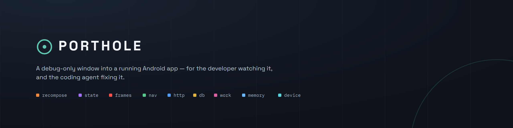

<p align="center">
  
</p>

<p align="center">
  <a href="LICENSE"></a>
  <a href="https://codecov.io/gh/gravityrepos/porthole"></a>
  
  
  
</p>

# Porthole

A window into a running Android app.

Porthole is a debug-only agent that lives inside your app and answers questions
about it while it runs: what recomposed and why, which frames were dropped and
where the time went, what is holding the main thread, what is in flight, what
your state actually contains right now.

It opens a loopback socket in debug builds, and `adb forward` bridges it to your
workstation. Two things connect to it, independently:

- **a live timeline** in your browser, for a person watching their own app
- **an MCP server**, for a coding assistant that can then read the answers and
  go change the code that caused them

The timeline is a complete tool on its own; the MCP half is additive. Between
them they cover:

| tool | answers |
| --- | --- |
| `findings` | start here: what is wrong right now, ranked, each with the tool that shows its evidence |
| `recompositions` | which composables recomposed, how often, and which state keys were written just before |
| `semantics_tree` | the semantics tree with an id that stays stable across captures |
| `nav_state` | back stack, arguments on each entry, and the deep link that got you here |
| `state` | current values of your ViewModel state, named automatically, and whether writes to it are attributable |
| `inflight` | open HTTP calls with the phase each is stuck in, running queries, WorkManager jobs |
| `frames` | dropped frames, and which phase of the frame ate the time |
| `blocking` | what held the main thread, with the stack it was stuck in |
| `logs` | the app's own logcat output, stack traces intact, without touching adb |
| `timeline` | the raw event stream, for ordering things relative to each other |
| `what_was_happening` | the narrative for one instant: screen, in-flight work, main thread, state just written |
| `system_context` | thermal state, CPU governor, busiest processes, memory pressure — the half Porthole cannot see |
| `capture_system_trace` | records a Perfetto trace, annotated with the app's own spans |
| `system_trace_start` | starts a continuous ring-buffer trace, detached, opt-in, for the problem that already happened |
| `system_trace_snapshot` | flushes the running ring to a file without interrupting it |
| `system_trace_stop` | stops the ring and removes everything it left on the device |
| `ask_system_trace` | puts a fixed set of questions to a captured trace, to rule causes in or out |
| `save_moment` | turns a window of what already happened into a named trace file, no recording required |
| `open_timeline` | a live timeline UI in the browser |
| `porthole_status` | whether any of the above can currently reach the device — and, now, why it died last time |
| `porthole_connect` | the parts of getting connected `porthole_status` cannot do on its own: install/version checks, launching, restarting |
| `setup` | which integrations are wired, which are only on the classpath, and — ranked by what it unlocks — the exact line to add for each one that is not |
| `screenshot` | the device screen right now, as an image — scaled, re-encoded, and refused rather than faked when a FLAG_SECURE window is on top |

Everything is debug-only. Release builds link a no-op artifact with identical
signatures, so the calls stay in your code and compile to nothing.

### What `timeline` admits

`timeline`'s `kinds` filter takes any of: `recompose`, `state_write`, `frame`,
`nav`, `http_start`, `http_end`, `db_start`, `db_end`, `log` (the nine kinds
the UI lanes already show), plus `log_append`, `mark`, `work_start`,
`work_end`, `blocked` (raw here too, with no lane of their own), `device`
(raw here; its one-time startup profile is what `findings` and `frames` read
their frame budget from, and its other sub-kinds cover lifecycle changes,
rotation, theme, font scale, power and network), `memory`/`gc` (raw here;
`gc` becomes a finding only when a collection blocks the app, and `device`'s
`trimMemory` sub-kind becomes one whenever the system actually asks for
memory back), and `exit` (narrated in `porthole_status`, and inventoried —
not just reported when it happened to cross a finding's threshold — in
`findings`' own `alsoInWindow`; see "Why it died" below). This list is kept
in sync with the runtime's own `EventKinds` object
(`runtime/.../protocol/Protocol.kt`) by a test that reads both sides.

### Why it died

The process holding the ring buffer is the process that crashed, so the ring
never has the answer to "why did it just die". `porthole_status` does: an
`exits` section carries the most recent process deaths Android recorded for
this app — `ActivityManager.getHistoricalProcessExitReasons`, read once per
launch — each with its reason (`REASON_ANR`, `REASON_CRASH`, and so on), when
it happened, the build that died (or the running build, flagged as assumed,
when the death predates anything the record itself names), and — for an ANR
or a native crash — the top frame of the main thread's stack. The same deaths
show up in `findings` at `error` severity (`note` for a user-requested exit;
nothing for a background `REASON_OTHER` kill), naming the reason, the build
and that same top frame.

Below Android 11 (API 30) `exits.apiUnavailable` says so rather than the
section silently reading empty. When nothing is currently connected and the
most recent exit is recent, `porthole_status`'s summary leads with it — "not
connected because it died" is a more useful first sentence than a generic
troubleshooting checklist.

The event itself carries a *summary* of an ANR/native-crash trace, not the
whole blob: the main thread's stack, app frames first (the same ordering
`blocking` uses), plus a count of the other threads and the states they were
in. The full trace — up to 256 KB, with a note if it was cut short — is one
more call away: `porthole_status {"exitTrace": <timestamp>}`, copying either
the epoch-milliseconds `timestamp` or the ISO-8601 `at` from that same entry
in `exits` — both are accepted and converted. Both the summary and the full
trace go through the same redaction every other captured string does,
before either ever leaves the process.

Not every exit reaches that `error`/`note` severity table — `REASON_OTHER`
and a plain `REASON_SIGNALED` kill produce no finding at all, because on
their own they are not evidence of anything. That used to mean an exit like
that was invisible to `findings` entirely, silence indistinguishable from "no
exit happened." `findings` and `what_was_happening` now both carry
`alsoInWindow`, present only when there is something to add: every process
exit in the window — including ones that already produced a finding above,
since the finding is the judgement and this is the inventory — plus plain
counts of device, memory, GC and memory-trim events that never rise to a
finding on their own. `alsoInWindow.exits` gives the same `reason`/`timestamp`
shape `exits` does, so `porthole_status {"exitTrace": <timestamp>}` still
works without a second lookup. The field, and the one sentence both tools
append for it, are absent — not empty — when there is nothing to add.

## Layout

```
runtime/         the agent: collectors, socket server, Compose wrappers
runtime-noop/    same public API, empty bodies, for release builds
gradle-plugin/   wires the artifacts in, owns the adb forward
mcp/             the MCP server (stdio) and the timeline server
mcp/ui/          the timeline itself: React 19, TypeScript, Vite, Tailwind
sample/          a small app with deliberate bugs, on two storage engines
site/            the landing page: one static file, no build step
brand/           the mark, its lockups, and the script that renders the rasters
```

## The sample

`sample/` is a cart screen wired to Room or SQLDelight, OkHttp, Ktor,
WorkManager and Navigation, with a planted recomposition bug for the porthole to
find. It serves its own API from a MockWebServer inside the app, so the demo is
self-contained: the traffic is real HTTP over a real socket, it just does not
need the internet. That server is plain `http://localhost`, which newer
devices block by default, so the debug build carries a `networkSecurityConfig`
permitting cleartext to `localhost`/`127.0.0.1` only (GRA-236).

It builds on two storage engines behind one `CartStore` interface, because the
porthole instruments the layer underneath both and the sample should have to
prove that rather than claim it:

```bash
./gradlew :sample:installRoomDebug         # Room
./gradlew :sample:installSqldelightDebug   # SQLDelight
adb shell am start -a android.intent.action.VIEW -d "porthole://cart/99001"
./gradlew :sample:portholeConnect
```

Either build produces db events with the same SQL, bound values, timings and
main-thread warnings. The only porthole-aware line in the SQLDelight flavor is
the `factory` argument to its driver.

Then turn on **Animate totals** and ask `recompositions`. The ticking state is
read directly inside each list row, so every row re-executes every frame:

```
read in the row:   2032 recompositions
    Cart.ItemRow              2032   (8 call sites)   <- CartViewModel.tick
```

Flip **Scoped reads**, which passes the state as a `() -> Int` so the read
happens in the leaf `Text` instead, and ask again:

```
read deferred:     2144 recompositions
    Cart.TotalPulse          2144   (8 call sites)
```

Same invalidation rate — the tick fires just as often — but `Cart.ItemRow` has
disappeared from the report entirely. The work moved from a whole `Card` + `Row`
+ `Button` subtree to one `Text`. That is the deferred-read lesson, measured
rather than asserted.

The other buttons each produce something worth looking at: a 402 with an error
body, a one-shot streaming upload, a binary download the body capture declines
to read, a main-thread stall with its stack, a Ktor call over the CIO engine,
and a WorkManager job that fails once and retries before succeeding.

Note that `CartViewModel` is never registered by hand. It is scoped to a
navigation entry, and the nav collector names it.

## What you need

**A device or emulator, with the debug build running.** There is no host-side
mode and there cannot be one: the porthole is code inside your app's process,
listening on a socket that never leaves the device — an Android
abstract-namespace Unix domain socket, named for the app's own package, not a
TCP port bound to any network interface (see [Setup](#setup) for why that
changed in GRA-199). `adb forward` is the only bridge, and it needs USB
debugging authorisation like anything else on adb. Emulator or physical
device makes no difference.

Everything else is the app you were going to run anyway. The porthole starts with
the process, so there is nothing to attach and no launch flag to remember.

## Compatibility

| | verified against |
| --- | --- |
| Gradle | 8.14 and 9.7 |
| Android Gradle Plugin | 8.9 and 9.4 |
| Configuration cache | stored and reused |
| minSdk | 26 |
| JDK | 17 for the plugin, 21 for the build |

**Abstract-namespace Unix sockets** (GRA-199's default bind) are not gated by
API level at all — they are a Linux kernel feature Android's own
`android.net.LocalServerSocket`/`LocalSocket` have wrapped since the
earliest public releases, the same mechanism `adbd`, `zygote` and
`installd` use for their own sockets, and `adb forward`'s `localabstract:`
scheme has existed alongside `tcp:` for exactly as long. There is no API 26
concern here that the loopback TCP bind this replaces did not already share.
Verified directly on this project's own emulator at API 36; a Robolectric
JVM test cannot exercise the real bind at all (see
`PortholeSocketServerBindTest`'s own comment for why), so the emulator run —
not a unit test — is this feature's actual proof on real Android code.

The plugin declares AGP `compileOnly`, so your build brings its own, and it
touches only the stable variant API. That is not the same as knowing it works,
which is why both ends of that range are tested rather than assumed:

```bash
./gradlew -p gradle-plugin test \
  -Pporthole.agpVersion=9.4.0 -Pporthole.gradleVersion=9.7.1
```

That check earns its place. AGP 9 ships `resValues` disabled by default, and
this plugin writes its port as a resource value, so every app on AGP 9 failed to
configure the moment it applied Porthole — while every test here passed, because
this repository builds on AGP 8 where the feature is on. The plugin now turns
the feature on itself. Worth running before each release, against whatever AGP
is newest.

This repository stays on Gradle 8 and AGP 8 deliberately: a great many apps are
still there, and it is the half of the range a compatibility test cannot cover
from the inside. The Gradle 9 deprecation warnings it prints all come from AGP
8 itself — none from this build — so moving it is an AGP bump and nothing more.

## Setup

**1. Apply the plugin to your app module.**

```kotlin
plugins {
    id("com.android.application")
    id("live.gravitylabs.porthole")
}

porthole {
    port.set(8677)                     // default
    debugBuildTypes.set(listOf("debug"))
}
```

The plugin puts `runtime` on your debug build types and `runtime-noop` on
everything else, and generates the `porthole_port` resource so the port is
configured in exactly one place.

`port` is **the host port the forward listens on**, not a port the device
opens. Since GRA-199, the runtime binds no TCP port on the device at all: it
listens on an Android abstract-namespace Unix socket named
`porthole.<applicationId>`, unique to your app by construction, and
`portholeConnect`/`portholeUi` forward `tcp:<port>` (on your workstation) to
`localabstract:porthole.<applicationId>` (on the device) rather than to a
second copy of the port. Two Porthole apps on the same device can never
collide on the device side any more — each has its own socket, named for its
own package, regardless of what `port` either of them is configured with.
`port` still matters on the host: two of *your own* MCP servers watching two
different apps on one workstation still need two different values, the same
as always.

**One socket per package, not per process.** A multi-process app (a
WorkManager-only process, a `:remote` service — multi-process apps are not
otherwise supported yet) has `PortholeInitializer` try
to install in every one of its own processes, since `androidx.startup` runs
per-process automatically. Every process races for the same
`porthole.<applicationId>` socket; the first one to start wins it, and every
other process's own install is left with nothing to bind. `adb logcat -s
Porthole:E` names the losing process, this app's package, and the one-line
fix: remove the manifest entry that runs `PortholeInitializer` automatically
(its own KDoc shows the snippet) and call `Porthole.install(application)` by
hand, only from the one process you actually want instrumented — normally
the main/UI process, which is also usually the one that wins the race
unmodified.

**Migrating from 0.2.x.** If you were on the plugin (`portholeConnect`,
`portholeUi`, `portholeStart`) already, there is nothing to do — the plugin
generates the new `adb forward` target for you, same as it always generated
the old one, and `.mcp.json` regenerates the same way. The only people who
need to act are anyone who ran `adb forward tcp:<port> tcp:<port>` **by
hand**, outside the plugin — a CI script, a personal alias, a tool that
shells out to adb on its own. That forward now points at a TCP port nothing
listens on. Either update it to `adb forward tcp:<port>
localabstract:porthole.<applicationId>`, or, for one release, set
`porthole { legacyTcpPort.set(true) }` (and, for the MCP server if you run it
directly rather than through the generated `.mcp.json`,
`PORTHOLE_LEGACY_TCP_PORT=1`) to keep the pre-GRA-199 shared TCP port while
you update whatever is forwarding by hand. `legacyTcpPort` is planned for
removal — it exists to buy migration time, not as a permanent alternative,
since it reintroduces the device-side collision this ticket removes.

**2. Run one task.**

```bash
./gradlew :app:portholeStart
```

That is the whole minimum: the plugin block above, and this one command.
`portholeStart` installs the debug build, then writes `.mcp.json`, fetches
`trace_processor` the first time anything needs it, and forwards the port and
opens the timeline in your browser — always in that order, a real Gradle
`mustRunAfter` chain rather than a naming coincidence, since the last step
blocks until you stop it. It is not new behaviour: it is `installDebug` (or
`install<Variant>` with flavors — `installRoomDebug`, not
`installRoomDebugDebug`; see below), `portholeMcpConfig`,
`portholeTraceProcessor`, and — forwarding the port — either `portholeUi` or
`portholeConnect`, never both, wired together so the order is not something
you have to learn. Doing anything unusual still means reaching for one of
those four directly — step 6 below is the reference table for that — and
each one works exactly as it always has.

Two things worth knowing before you run it:

- **More than one debug build variant** (a `productFlavors` block, like the
  sample's `room`/`sqldelight` storage flavors) means `portholeStart` cannot
  guess which one you want installed, and refuses rather than picking. Name
  the variant itself, the way `install<Variant>` already ends — not the
  flavor alone — so the sample's Room flavor is `roomDebug`:
  `./gradlew :app:portholeStart -Pporthole.variant=roomDebug`. One variant is
  picked automatically; more than one is always asked for, never guessed.
- **An agent driving this** — no one at a keyboard to look at a browser
  window — wants `-Pporthole.open=false`, which does everything except open
  the timeline. A person running it by hand gets the browser by default,
  since that is what `portholeUi` alone has always done.
- **Two things land in your project root, and one of them belongs in
  `.gitignore`.** `.porthole/` holds every recorded session and every saved
  trace (see [Sessions on disk](#sessions-on-disk)); it is runtime output
  from your own app, grows to 500 MB by default, and should never be
  committed — add `.porthole/` to your `.gitignore` before the first run.
  `.mcp.json` is the agent's config; its `env` block carries absolute paths
  for this machine (`PORTHOLE_PROJECT_ROOT`, `PORTHOLE_SDK_DIR`), so commit
  it only if everyone on the project regenerates it with
  `./gradlew portholeMcpConfig` rather than sharing one copy.
- **If `porthole_status` says "not connected", it already tried to fix the
  one thing it safely can** before answering: it lists attached devices and
  re-establishes `adb forward` on its own, so a dropped forward is usually
  invisible — call it again and it is just connected. It never installs,
  launches or restarts anything on its own; when the fix needs that (not
  installed, a release build, installed but not running), it names
  `porthole_connect`, a second tool that can act on the app under test.
  `restart`/`launch` judge success by the app's process actually coming up
  (`pidof`, polled for a couple of seconds), not by what the launcher
  printed — a noisy or silent-looking launch is not read as a failure. When
  it can resolve the launcher activity directly, it launches through `am
  start -W` rather than `monkey`, and the result's payload carries that
  call's own `launchState` (`COLD`/`WARM`/`HOT`) and `totalTimeMs` (GRA-233).
- **If nothing responds once "connected", something is holding the *host*
  port** — the only place a collision can still happen since GRA-199.
  `portholeConnect`'s `adb forward` succeeds whether or not anything else on
  this workstation already has `PORTHOLE_PORT` bound, so if the MCP server
  still can't reach the app, check what is listening on it locally (another
  of your own MCP servers pointed at a different app is the common case) and
  stop it, or give this app's `porthole { port.set(...) }` a different
  value. The device side cannot collide any more: each app binds its own
  abstract socket, named for its own `applicationId`, so running the sample
  and then your own app no longer means one of them loses a race for a
  shared port — see [Compatibility](#compatibility) for why, and the
  migration note below if you were forwarding by hand before this.
- **If it says "connected" but is answering for the wrong app**, the MCP
  server has `PORTHOLE_APPLICATION_ID` (written into `.mcp.json` by
  `portholeMcpConfig` from AGP's own `applicationId`) and compares it
  against every `hello` — a mismatch warns loudly (`porthole_status`, every
  tool's banner, the timeline UI's pill in the danger tone). This can still
  happen on the *host* side: two apps that happen to share one
  `PORTHOLE_PORT` on your workstation, forwarded one at a time, will each
  answer as themselves in turn, and the mismatch check is what catches you
  pointing an old `.mcp.json` at whichever one is currently forwarded. Give
  each app its own `PORTHOLE_PORT` (`porthole { port.set(...) }`) to run both
  at once.
- **A device with two adb transports at once** (wireless plus wired, most
  commonly) makes `adb forward` ambiguous, and it fails silently for
  exactly the port this all depends on. `adb devices` lists more than one
  line for the same device when this is happening; pin one with
  `porthole { deviceSerial.set("...") }`.

The runtime starts with the process through androidx.startup and finds the
current Activity on its own, which gives it the view it needs for the
semantics tree and the view models scoped to that Activity. There is nothing
to wrap and no launch flag to remember.

Screen-scoped view models need step 3.

**3. Register your NavController.** One line, and it earns more than it used to.

```kotlin
val navController = rememberNavController()
LaunchedEffect(navController) { Porthole.registerNavController(navController) }
```

Besides the back stack, this is how screen-scoped view models get named.
`viewModel()` inside a `NavHost` scopes its model to the `NavBackStackEntry`
rather than to the Activity, which is the ordinary arrangement rather than an
edge case — so the nav collector names the view models on each entry as you
arrive at it.

On Navigation 3 there is no controller to register, because the back stack is a
snapshot list your code owns. Hand it over instead:

```kotlin
val backStack = rememberNavBackStack(HomeKey)
PortholeBackStack(backStack)
NavDisplay(backStack = backStack, ...)
```

**4. Instrument the clients you care about.** This is the part that cannot be
automatic: instrumenting a client means being handed the builder before it is
built, and nothing can discover that for you. Each is one line, each independent.

```kotlin
import live.gravitylabs.porthole.*

// OkHttp. Phases, connection reuse, protocol, byte counts, status codes and
// headers. No bodies — chains onto your own EventListener if you set one.
OkHttpClient.Builder().installPorthole().build()

// Bodies too, when you are debugging a payload rather than a timing.
OkHttpClient.Builder().installPorthole(bodies = BodyCapture.Text).build()

// Ktor, for clients not on the OkHttp engine.
HttpClient(CIO) { install(portholeKtor()) }

// Room. Bound values are recorded by default; captureBindArgs = false stops it.
Room.databaseBuilder(context, AppDb::class.java, "app.db").installPorthole().build()

// SQLDelight, or anything else built on androidx.sqlite.
AndroidSqliteDriver(schema = Schema, context = context, name = "app.db",
    factory = portholeSqliteFactory())
```

One import covers all of them. And if you forget one, the runtime says so a few
seconds after start rather than leaving you with an empty lane that looks the
same as an app which made no requests:

```
I Porthole: not instrumented: okhttp — add installPorthole() to your OkHttpClient.Builder
```

It only says that for libraries actually on your classpath, so an app with no
database is never told about Room. The timeline says it too, on the lane
itself — an empty http lane reads "okhttp or ktor not instrumented" rather
than looking like an app that made no requests.

**Every integration is optional and independent.** Instrument HTTP and not the
database, or neither. Verified by stripping all four from the sample: the run
still produced recompositions, state writes, frames, main-thread stalls,
memory, GC, device context, logs and WorkManager. Only the lanes you did not
wire are empty, and those say why.

Room was never the thing being instrumented — `SupportSQLiteOpenHelper` was, and
Room is one of the things that opens a database through it. That is why the same
factory covers SQLDelight, and why the database inspector reads both.

If your Ktor client uses the OkHttp engine, install the OkHttp porthole on that
engine instead and you get more: OkHttp's own `EventListener` sees DNS,
connect and TLS as separate phases, plus connection reuse, protocol and byte
counts — none of which a plugin sitting above the engine can see, on any
engine (see [HTTP](#http)).

WorkManager needs nothing. If it is on the classpath it is observed, and every
attempt appears on the timeline — retries as separate bars, which is usually the
thing you are looking for.

**5. Optional: name things the tool cannot name for itself.**

Automatic naming covers view models. State a composable creates for itself has
no owner to reflect over, and a composable has no name of its own, so those are
worth a word each:

```kotlin
@Composable
fun CartScreen(viewModel: CartViewModel) = PortholeScreen("Cart") {
    val items by viewModel.items.collectAsNamedState("CartViewModel.items")
    val query = rememberNamedState("Cart.query", "")

    LazyColumn {
        items(items) { item ->
            CartRow(item, modifier = Modifier.portholeNode("Cart.ItemRow"))
        }
    }
}
```

`PortholeRoot` still exists and still names the root screen, but it is no longer
required for the semantics tree — the runtime attaches to the Activity's decor
view by itself.

**6. The pieces, individually.** `portholeStart` in step 2 is four of these
five tasks, for one variant, in a fixed order — `portholeConnect` and
`portholeUi` both forward the port, so exactly one of them runs, never both.
Reach for any of the five directly for anything `portholeStart` does not
cover — a second device, the UI without a fresh install, a config entry
regenerated after editing `.mcp.json` by hand:

| task | does | reach for it directly when |
| --- | --- | --- |
| `install<Variant>` | installs the debug build (AGP's own task, e.g. `installDebug` or, with flavors, `installRoomDebug`) | you only need the build on the device, nothing else |
| `portholeConnect` | `adb forward`s the port and writes the connection file | your agent is doing the looking and you do not want a browser — `portholeStart -Pporthole.open=false` uses this instead of `portholeUi` |
| `portholeMcpConfig` | writes the MCP server entry into `.mcp.json` | you edited `.mcp.json` by hand and want the entry regenerated, or need `-Pporthole.overwrite=true` |
| `portholeTraceProcessor` | fetches and verifies Perfetto's `trace_processor`, once | you want it ahead of time, or `-Pporthole.refresh=true` to re-fetch it |
| `portholeUi` | forwards the port itself, serves the UI, opens your browser, and keeps running until you stop it | you already installed and connected, and only want the timeline again |

A sixth task, `portholeComposeReport`, is deliberately not in this table or
in `portholeStart`'s own five — it is not part of getting connected, it is a
standalone, opt-in diagnostic (enables the Compose compiler's own reports,
parses them) that only runs, and only costs anything, when named directly:
see [A recomposition hotspot says why it is not skippable](#a-recomposition-hotspot-says-why-it-is-not-skippable).

`portholeUi` and the npm CLI it launches are the same thing, so without the
plugin applied — or without Gradle at all — this does what `portholeUi` does:

```bash
npx @gravitylabsllc/porthole ui
```

Both need Node, because the UI is a web app. The MCP server and the UI are
independent — run either, or both at once, and each opens its own connection
to the device.

**7. Point your agent at it.** `./gradlew portholeMcpConfig` prints the entry:

```json
{
  "mcpServers": {
    "porthole": {
      "command": "npx",
      "args": ["-y", "@gravitylabsllc/porthole@0.2.2", "mcp"],
      "env": { "PORTHOLE_PORT": "8677" }
    }
  }
}
```

`0.2.2` here is whatever `porthole { uiPackageVersion }` resolves to for the
build that wrote the file — the plugin's own version by default, so the
number moves with whichever plugin version generated your `.mcp.json`. The
npm package is pinned to it (same version `portholeUi` launches and the
runtime AAR resolves to) — without the pin, `npx` resolves the unqualified
package name to whatever the registry calls `latest` at the moment your MCP
client starts the server, which can drift from the plugin and runtime you
actually applied. Building the CLI yourself? `porthole { mcpCommand.set(...) }`
replaces the `npx` launch entirely, the same way `uiCommand` does for
`portholeUi` — this repo's own sample does exactly that, pointing at
`mcp/dist/cli.js`.

`./gradlew portholeMcpConfig` writes that entry for you. It merges rather than
overwrites, so other servers in the file are untouched, and if a `porthole`
entry is already there and differs it prints the difference and leaves it —
a different entry is usually deliberate. The one exception: an existing entry
that differs *only* in the pinned version is a plugin bump, not a deliberate
edit, so that one rewrites on its own, no flag needed, logging the version it
moved from and to. `-Pporthole.overwrite=true` is for every other kind of
difference — a different port, a hand-added env var, anything wider than the
pin — and the previous file is kept as `.mcp.json.bak` either way.

**Environment variables**, for anyone not going through the generated
`.mcp.json` above:

| variable | default | what it sets |
| --- | --- | --- |
| `PORTHOLE_HOST` | `127.0.0.1` | host the forwarded device socket is reachable on |
| `PORTHOLE_PORT` | `8677` | the host port the forward listens on — not a port the device opens; see [Setup](#setup) |
| `PORTHOLE_UI_PORT` | `8678` | port the timeline is served on |
| `PORTHOLE_TRACE_PROCESSOR` | none | path to Perfetto's `trace_processor`, for [system traces](#system-traces) |
| `PORTHOLE_TRACE_TIMEOUT_MS` | `60000` | how long `ask_system_trace` waits on `trace_processor` per question before giving up |
| `PORTHOLE_SESSIONS` | on | set to `0` to turn off [sessions on disk](#sessions-on-disk) entirely |
| `PORTHOLE_SESSIONS_MAX_BYTES` | `524288000` (500MB) | total size before the oldest session is pruned, see [Sessions on disk](#sessions-on-disk) |
| `PORTHOLE_SESSIONS_MAX_AGE_DAYS` | `7` | age before a session is pruned regardless of size, see [Sessions on disk](#sessions-on-disk) |
| `PORTHOLE_APPLICATION_ID` | none | the app this server expects — written by `portholeMcpConfig` from AGP's own `applicationId` on an application module, or from `porthole { applicationId.set(...) }` if you set one explicitly. Compared against every `hello` (a mismatch warns loudly — `porthole_status`, every tool's banner, the timeline UI's pill) **and**, since GRA-199, is what names the abstract socket `porthole_status`/`porthole_connect` forward to (`localabstract:porthole.<applicationId>`) when they have to (re-)establish the bridge themselves — without it, and without `PORTHOLE_LEGACY_TCP_PORT`, those two tools refuse to guess a socket name and say so |
| `PORTHOLE_LEGACY_TCP_PORT` | unset | set (to any truthy value) to forward to the pre-GRA-199 shared TCP port instead of the abstract socket — written by `portholeMcpConfig` only when `porthole { legacyTcpPort.set(true) }`. See the migration note in [Setup](#setup) |
| `PORTHOLE_SERIAL` | none | which attached device `porthole_status`/`porthole_connect` should use when more than one is plugged in — same purpose as `porthole { deviceSerial.set(...) }`, for a server started without the generated `.mcp.json`. A tool's own `serial` argument overrides it for that one call |

Two more exist but you should not normally set them by hand: `PORTHOLE_PROJECT_ROOT`
and `PORTHOLE_SDK_DIR` are written into the generated `.mcp.json` by
`portholeMcpConfig`, which knows both with certainty — the Gradle root
project directory, and the SDK resolved the same way the plugin resolves it
for `adb` itself — rather than guessing from whatever directory an MCP
client happened to launch the server in. `porthole_status` reports which
source each came from (`PORTHOLE_PROJECT_ROOT` or `cwd` for the root;
`PORTHOLE_SDK_DIR`, `local.properties`, `ANDROID_HOME`, `ANDROID_SDK_ROOT` or
`PATH` for the SDK), which is where to look first if a resolved path looks
wrong.

## What you actually have to write

The short answer to "is it just the plugin and a dependency": nearly.

| | |
| --- | --- |
| the plugin | required — it brings the runtime and owns the port |
| `registerNavController` | one line, if you use Navigation |
| `installPorthole()` on each client | one line each, and unavoidable |
| everything else | optional, for better names |

View models, the semantics tree, frames, the main thread, memory, WorkManager,
logs and device context all need nothing at all.

## Checking what's wired

Forgetting one of the lines above looks exactly like an app that never made
the call — an empty lane either way. `setup`, the MCP tool, answers "did I
forget one" directly: every integration the runtime can see, on the
classpath or not, instrumented or not, plus the `socket` entry (did the
loopback socket bind) and the [StrictMode](#strictmode) entry.

For each integration that is present but unwired it gives the exact line to
add and names which lanes and MCP tools go dark without it, ranked so the
gap that leaves the most dark comes first — instrumenting neither OkHttp nor
Ktor empties the `http` lane and leaves `inflight` and `blocking` with
nothing to say about HTTP calls, which outranks a gap that only costs one
tool. A fully-instrumented project gets an explicit "everything present is
wired" rather than an empty list that reads the same as "nothing to check."

It cannot find the `OkHttpClient.Builder` in your project and point at it —
being handed a builder before it is built is the only way to attach to one,
and a real app usually has several. `setup` names which library needs a
line, never where in the project to add it. `porthole_status` already names
it for you whenever an integration looks present but unwired, so reaching
for `setup` yourself is usually just to get the exact snippet.

## What the timeline shows

Lanes, sharing one clock: findings, recompositions and state writes, dropped
frames and main-thread stalls, navigation, http, db, work, memory, device
context, and your own logcat at warning and above.

A few of them are worth knowing about because the number means something
specific. Dropped frames are counted in refreshes, so a 400ms freeze is not "one
missed frame". Work gets one bar per attempt, so a retry is visible rather than
averaged into a single long one. The main thread lane carries both stalls and
the queries that ran on it.

Clicking any mark opens it: the subject first, then its attributes, then whatever
bulk it carries. `ask agent` copies the window as bounds.

The findings lane is the first one, above recompositions, and it is the one
lane whose data is a server answer rather than the event buffer — it has its
own loading, stale and empty states, so a request still in flight does not
read as "nothing is wrong." Severity is colour, matching the insights panel
exactly; confidence is a solid mark for `observed` and an outline for
`correlated`; source is a small filled-versus-hollow mark at the mark's edge.
A `spanning` finding draws as a dim band across the window it was asked
about rather than as a point, since it has no narrower moment to sit under.
Findings that overlap on screen stack up to three rows before a `+N` glyph
takes over. With no trace loaded, the lane still shows Porthole's own
findings and says the trace half is missing in one line.

That trace half comes from a capture chosen in the insights panel header: a
small dropdown, fed by `GET /api/traces`, listing captures by when they were
recorded. A capture whose coverage could not be read (`coverage: null`) is
listed with its reason and cannot be chosen. Once one is chosen, the ruler
grows a thin bar under it showing which part of the visible axis that
capture's coverage actually covers — the difference between "the trace has
nothing to say about this window" (no bar reaches it) and "the trace says
nothing was wrong here" (the bar reaches it and the lane is quiet), which
otherwise look identical.

Selecting a dropped frame, a main-thread stall, or a finding adds an
**ask the trace** action to the selection panel — the gesture that replaces
opening a trace viewer. It asks about that hit's own window (its duration,
centred, floored at 200ms of total width — never the visible view) against
whichever capture's coverage actually contains it: the one chosen above if
its coverage reaches that far, otherwise the first listed capture that does,
otherwise none. With none, the panel says plainly that no capture covers that
moment and offers a copy-ready prompt for taking one. Otherwise it asks
`GET /api/findings?trace=<id>&from=&to=` — the same endpoint the lane above
already uses, no second implementation — and renders the answer sourced and
confidence-labelled like every other finding, including a line for each
question the trace answered that ruled something out rather than finding it:
"the main thread was running for all of it" is as much an answer as a jank
finding is. A copy-ready prompt names the same bounds for pasting at an agent.
The answer is cached per capture and window for the session, so re-selecting
the same hit never re-asks.

The header also has **database**, a read-only inspector over the app's own
tables — list, page, and run a SELECT — and **restart app**, which force-stops
and relaunches over adb.

The inspector reads through an undecorated handle, so looking at a table does
not emit query events for the act of looking. It refuses anything that is not a
single SELECT, WITH, or a PRAGMA with no assignment in it. That is enforced on
the device rather than assumed from the socket being loopback.

### Timeline server API

`GET /api/findings` is the one place a trace-derived finding and a Porthole
finding sit in one list, on one severity vocabulary, each carrying a `source`.
Add `?trace=<id>` to merge in what a system trace has to say about the same
window; the id has to be one `GET /api/traces` just listed — an arbitrary
filesystem path is refused, before anything is spawned. When a trace was
actually queried, the response also carries `asked`: one `{ id, answered }`
per question `ask_system_trace` puts to it, so a caller can tell "this
question was answered and ruled nothing out" apart from "this question was
never reached" — the two look the same from the finding list alone.

`GET /api/traces` lists what is under `.porthole/traces/`: `id` (the file name,
without `.pftrace`), `bytes`, `recordedAt`, and `coverage` — the uptime window
the capture covers, `{ from, to }` in the same clock every finding's own
`window` is in, or `null` with a `reason` when trace_processor could not read
it (missing binary, no clock snapshot). It is how a caller finds out whether a
trace has anything to say about what is on screen right now without opening
it.

Every finding either carries a `window` in that clock or is marked
`spanning: true` for one that is a property of the whole window asked about
rather than a moment inside it — a thread-state aggregate summed across
however many stretches the scheduler visited that state, say. Drawing either
as a point under one frame would invent a precision neither one has.

## Capturing a run with nobody watching

The timeline is for a person looking at their own app. On CI there is nobody
looking, so a capture writes a file instead.

```bash
porthole capture --scenario checkout --out trace.json -- ./gradlew connectedRoomDebugAndroidTest
porthole report trace.json
porthole compare baseline.json trace.json
```

It wraps a command rather than asking anything of it, so `connectedAndroidTest`,
Maestro, a shell script and an agentic driver are all just a command. The
process lifetime is the capture window.

What comes back is a short list of what is worth looking at, not a dump:

```
checkout · 9.8s · Google sdk_gphone16k_x86_64 (60Hz) · com.example.shop

  ERROR    1 database query ran on the main thread
           Worst was 3ms: SELECT * FROM cart_items WHERE cartId = ? ORDER BY addedAt DESC
  ERROR    main thread blocked for 305ms
           during "block the main thread"
           com.example.shop.ui.CartViewModel.blockTheMainThread(CartViewModel.kt:146)
  ERROR    1 HTTP call failed
           POST http://localhost:54779/v1/checkout → 402
  WARNING  158 frames missed their deadline (budget 16.7ms at 60Hz)
           worst 276ms · most often in swapBuffers

  quiet: memory

  frame budget 16.7ms · 214 recompositions · 4 calls (2 still open) · 11 queries
```

The last "quiet" line is not padding. A report that only ever lists problems
gives no signal that the things it did not mention were actually checked.

The footer's counts include spans that were still open when the capture
ended — a call that never came back still happened and still cost the wait —
and the `(N still open)` qualifier travels with the number it counts so "4
calls" cannot be misread as four completions. It is left off entirely when
nothing was open, which is almost every run.

Every finding carries how strongly it can be claimed. **observed** means the
device said so — a query ran on the main thread, a frame missed its deadline.
**correlated** means two things happened near each other, which is ordering and
not causation; the recomposition hotspot is the only one of those, and it says
"ordering, not proof" in its own text. There is no `cause` field.

### `--systrace`: the device's view, alongside the app's own

`porthole capture` records what the app itself saw; `capture_system_trace`
and `ask_system_trace` (see [System traces](#system-traces) below) record
what the whole device was doing. They used to never meet, which meant a CI
regression could be described but not explained — was it thermal
throttling, ART still compiling, or the app itself? `--systrace` closes that
gap:

```bash
porthole capture --scenario checkout --systrace -- ./gradlew connectedRoomDebugAndroidTest
```

* `--systrace-seconds <n>` — the on-device recording's own safety ceiling,
  1-120s (the same clamp `capture_system_trace` uses). Defaults to the max,
  because the *real* bound is the command's own lifetime: the recording
  starts in the background right before the command runs and is stopped the
  moment it exits, whichever of the two ends first. It never blocks the
  command waiting on a fixed duration.
* `--systrace-categories <a,b>` — atrace categories, comma-separated.
  Defaults to the same set `capture_system_trace` uses.

Two files come out: `<out>` (the trace JSON, as always) and `<out>` with its
extension swapped for `.pftrace` — `porthole-trace.json` and
`porthole-trace.pftrace` by default. When `trace_processor_shell` can be
found (see `capture_system_trace`'s own paragraph below for how it is
fetched), the system trace is asked the same eight questions
`ask_system_trace` answers, scoped to the window the capture covered, and
the answers are merged straight into the same `findings` list `porthole
report` already prints — each one now carrying `source: "porthole"` or
`source: "trace"` so a reader (or another tool) can tell which side is
making the claim. `porthole report` tags a trace-sourced finding `[trace]`
so it reads differently at a glance from one the runtime itself observed.

**No `trace_processor_shell`, no problem — mostly.** The capture and the
`.pftrace` still happen. What does not happen is the eight questions: a
note in the trace JSON's `systrace.notes` says so and names
`./gradlew portholeTraceProcessor` as the fix, the same binary
`capture_system_trace`/`ask_system_trace` need. The `.pftrace` itself is
always readable at ui.perfetto.dev regardless.

**`portholeLabels: 0` is a warning, not a footnote.** If the on-device
recording came back with none of the runtime's own atrace sections in it —
the app was not running with the runtime attached, or this device only
reads the app trace tag at process start (see the restart note under
`capture_system_trace` below) — that is a `warning`-severity finding in the
same `findings` array, not just a sentence you have to go looking for.

`compare` was never told to look at `findings` in the first place — it only
ever diffs `metrics` — so a baseline captured without `--systrace` compares
cleanly against a run captured with it, and the other way around too.

### Steps

`Porthole.mark("checkout")` puts a label on the timeline, and findings name the
mark they fell under. An instrumented test runs in the app's process, so a
`connectedAndroidTest` can mark its own steps with no protocol and no
coordination; the app can mark its own phases the same way.

### Regressions

`compare` diffs the metrics, with two rules that keep it honest. Changes below
both a relative and an absolute floor are noise and are not reported — without
both, every run is a regression and the check gets switched off. And zero to
non-zero is always reported, however small, because the first main-thread query
is categorical rather than a drift.

It refuses outright when the two runs were never comparable — a different
scenario, refresh rate, or core count — and **exits 2 when it refuses**, because
a gate that compared nothing should not go green.

One caveat worth knowing before wiring this to CI. Findings are categorical and
survive any driver, including an exploratory one. Timing comparison does not: a
driver that reasons between steps varies its own pace and path, so
`frames.p95Ms` drifts for reasons that are not your code. Gate timings on a
deterministic driver — Macrobenchmark, UiAutomator, Maestro — and use
`--driver <name>` so `compare` can point out when two runs were driven
differently.

Not settled yet, and worth knowing before leaning on this:

- **Where a baseline lives.** A file in the repo is reviewable but goes stale. A
  rolling baseline from the last green build catches drift but hides a slow
  decline. Probably both, with the repo file winning.
- **One run is one sample.** Repeating a scenario and taking the median is the
  only way a timing gate is really trustworthy, and it costs CI minutes. Worth
  measuring the variance before deciding.
- **Stacks in release builds.** They come through readable from a debug build. A
  minified capture would need mapping, which is a larger piece of work.
- **`--driver` is a label**, and a label is only as honest as whoever typed it.
  `compare` can say two runs were driven differently; it cannot tell.

There is no start/stop control surface, deliberately. A driver that runs as a
library inside someone's test process cannot be wrapped as a command and would
want one — but it is worth nothing until such a driver integrates with it, and
it brings lifecycle problems the wrapper does not have, starting with a crashed
test leaving a capture running forever.

## porthole watch

MCP cannot interrupt an agent's turn — there is no push, and an MCP server is
not allowed to run background work of its own. An agent's *harness* can,
though: Claude Code notices when a background bash task exits, and it runs
hooks. `porthole watch` is a process built for exactly that seam: it blocks,
watches the app for you, prints one line the moment something crosses a
severity threshold, and exits non-zero.

```bash
porthole watch                              # run forever, one line per finding
porthole watch --until-first                # block, then exit 1 the instant one lands
porthole watch --json                       # one finding object per line, for a hook
porthole watch --until-first --timeout 300  # give up after 5 minutes if nothing happens
```

It connects like any other client — its own socket to the device, independent
of whatever MCP server may also be attached (`PortholeSocketServer` already
serves several clients at once; the timeline and an MCP server are proof of
that) — and streams findings as they occur rather than answering one question
and exiting. Default severity is `error`; `--severity warning` or
`--severity note` widen it.

**Forwarding, same as `porthole ui`/`porthole capture`.** Since GRA-199 the
device side listens on an abstract socket named for the app
(`localabstract:porthole.<applicationId>`), not a shared TCP port, so `watch`
needs to know the app it is forwarding to before it can bridge anything.
`PORTHOLE_APPLICATION_ID` (written into `.mcp.json` by `portholeMcpConfig` —
see [Setup](#setup)) covers this for free in the ordinary case; running the
CLI on its own, pass it explicitly: `porthole watch --application-id
com.example.shop`. Without either that or `--legacy-tcp-port` (see the
[GRA-199 migration note](#setup) if you are still on the pre-migration shared
TCP port), `--forward` refuses outright — the same refusal `ui`/`capture`
already give — rather than guessing a socket name and silently forwarding to
one nothing is listening on, which is exactly the failure mode an earlier
version of this command had: it kept issuing the pre-GRA-199 `adb forward
tcp:<port> tcp:<port>`, and on real hardware that rewrote a working forward
into a dead one without saying a word.

A finding line carries everything the ticket that sent you here needs to
quote into `findings`/`what_was_happening`:

```
ERROR  main thread blocked for 6240ms  t=2088311..2094551  com.example.shop.ui.CartViewModel.blockTheMainThread(CartViewModel.kt:146)
```

Severity, the finding's own title, the window on the device uptime clock
(`t=from..to`, the same clock every tool call already speaks), the first line
of its detail, and — when `PORTHOLE_PROJECT_ROOT` is set and
[`where`](#handing-a-moment-to-the-agent) resolves — `where=<path>:<line>`,
the resolved, project-relative file an agent can open directly. `--json`
prints the same finding as one JSON object per line instead, for a hook to
parse with `jq`; every diagnostic (connection state, reconnect chatter) goes
to stderr only, so stdout is never anything but findings.

**One line per occurrence — except for an episode still in progress.** A
stall, a failed call, a query on the main thread: `findingsOf` anchors each
of those on one specific contributing event (the worst stall so far, the
first failure), so a fresh line means a genuinely new, distinct occurrence
happened, and `watch` prints every one of them. `frames-dropped` and
`recompose-hotspot` are the opposite shape — their `count` is a running
tally over one continuous, still-open episode (missed frames summed across
the jank so far; a component's own recompositions summed across the storm so
far), which climbs on essentially every tick for as long as the episode
lasts. Printing those on the same "count grew" rule floods a `--json` hook:
one jank episode measured seventeen lines, counts walking 32 → 209, roughly
one line a second for as long as it lasted — seventeen lines about the same
problem, not seventeen problems. Those two ids alone reprint at most once
every 10 seconds while their own episode is still ongoing; everything else is
unaffected.

**Deduplication.** A `watch` running alongside a live agent session must not
repeat what the agent's own ["since your last call" banner](#what-happened-while-you-were-not-looking)
already surfaced, and must not make that banner repeat what `watch` already
put in front of the harness. The decision: `watch` opens the exact same
on-disk watermark (`<session dir>/watermark.json`) the MCP surface's banner
uses, keyed by the device's `hello` identity the same way
[sessions on disk](#sessions-on-disk) already are, and reads/advances the
very same `lastReportedErrorT` field — not a parallel one of its own. This
only ever applies to `error`-severity findings, matching what that field
already means; `--severity warning`/`--severity note` still dedupe repeats,
but only within `watch`'s own run, since there is no shared field for those
severities to share.

Not full mutual exclusion, and it does not claim to be: refresh-then-decide-
then-write is three steps, not one atomic compare-and-swap, so a `watch` and
the MCP surface's banner — or two `watch`es — that both make that decision
inside the same ~200ms poll interval can still both report the same error
once. Neither repeats it afterward, once each has seen the other's write —
"within one poll interval both may report," not "never."

**Exit codes**, and nothing else stops it:

| code | meaning |
| --- | --- |
| 0 | clean stop — SIGINT |
| 1 | `--until-first` found a qualifying finding (on stdout) |
| 2 | bad arguments, or an internal error stopped the watch |
| 3 | `--timeout` elapsed with nothing (yet) to report |

A disconnect is never on that list. `porthole watch` reconnects on its own,
exactly like `porthole ui` — the app restarting mid-session is normal, not a
reason to stop watching it.

### The Claude Code recipe

**Background task**, for a loop that wants to keep working and get notified
the moment something breaks:

```bash
porthole watch --until-first --application-id com.example.shop
```

Run it the way you'd run any long-lived command in Claude Code — as a
background bash task. Claude Code notifies the agent when a background task
exits; `--until-first`'s exit code (1, with the finding already on stdout) *is*
the notification, and the finding is already there to paste into `findings`
without another tool call. `--application-id` is shown explicitly here on
purpose — a recipe meant to be pasted as-is should not depend on whatever
happened to already be exported in that shell; drop it if
`PORTHOLE_APPLICATION_ID` is already set (it usually is, once
`portholeMcpConfig` has generated `.mcp.json`).

**Hook**, for a gate that runs once and reports back — `--json` so the hook
can parse what it found:

```json
{
  "hooks": {
    "PostToolUse": [
      {
        "matcher": "Bash",
        "hooks": [
          {
            "type": "command",
            "command": "porthole watch --until-first --json --timeout 30 --severity error --application-id com.example.shop; code=$?; if [ $code -eq 1 ]; then exit 2; fi; exit 0"
          }
        ]
      }
    ]
  }
}
```

`exit 2` from a hook is what tells Claude Code to block and show the agent
its stderr/stdout — quoting the JSON line straight back gives it the window
and the evidence in one shot. `exit 0` for a clean `--timeout` (nothing
happened) or a genuine connection failure lets the tool call through rather
than wedging the loop on a hook that could not reach the device.

On Windows, quote the whole command for the shell running it (PowerShell:
double quotes around the command, no shell-specific escaping inside — the
example above is POSIX `sh`, which is what Claude Code's own hook runner
invokes on every platform it supports; check its own hook documentation
before adapting the command line itself, not the quoting shown here).

### Open questions this settles

- **Sharing the device with a running MCP server.** Proven, not assumed:
  `watch.test.ts` runs a `watch` beside a full MCP server rig on the same
  fake device and checks both see the same events.
- **A hung watch wedging a hook.** `--timeout <seconds>` — exit 3, decided
  and tested above.
- **Exit codes.** Decided and tested: 0/1/2/3 as the table above, chosen to
  match `porthole capture`'s own `process.exit(2)` discipline for bad
  arguments rather than invent a fifth code for the same fact — code 2 also
  covers an internal defect (a crash inside the finding-evaluation loop
  itself), never code 1, which a hook would otherwise read as a genuine
  finding with nothing on stdout to back it up.

## Handing a moment to the agent

The two halves share a clock: every event, every log line and every report is
stamped in device uptime. That is what makes the handoff work.

When the timeline shows you something it cannot explain — a recomposition spike
with no obvious cause — zoom to it and press **Ask agent**. It copies the window
you are looking at, as bounds rather than prose:

```
Using the porthole MCP tools, look at device uptime 2057010 to 2075089.
That window contains: recompose 1145, state_write 161, log 71, db_start 4, nav 1.
Start with recompositions {"from": 2057010, "to": 2075089} and logs
{"from": 2057010, "to": 2075089, "level": "W"}.
```

Paste that at your assistant. `recompositions`, `logs` and `timeline` all take
absolute `from`/`to`, so it asks about the moment you actually saw instead of
guessing a lookback and hoping the windows overlap.

### What happened while you were not looking

MCP has no push — a server cannot interrupt an agent's turn. The gap this
leaves is the ordinary agentic loop: ask a question, think for a while, ask
another. In between, the app can ANR and nothing says so; the next call
either misses it or, worse, re-reports the same three findings it already
investigated.

Every window-taking tool (`findings`, `save_moment`, `recompositions`,
`frames`, `blocking`, `logs`, `timeline`) accepts a `since` parameter next to
`sinceMs`/`from`/`to`, and it is the default whenever none of those three are
given:

- `since: "last"` (the default) starts where the previous window-taking tool
  call on this session left off, so a call with no arguments never misses
  anything and never re-reads what was already examined. The first call a
  session ever makes has nothing to start from, so it behaves exactly like
  today's default — the whole buffer — and its summary says so.
- `since: "all"` is the reset: the whole buffer plus disk, the same as every
  call before `since` existed, and it clears the tracking `since: "last"`
  uses. There is no separate `reset_watermark` tool — this is the reset.

This tracking (`lastExaminedT`, an error-severity digest, and `findings`' own
last result) is a **watermark**: one per MCP server process, keyed to
whichever session is currently open, held in memory and written through to
`<session dir>/watermark.json` beside `events.ndjson` on every update. It
survives an MCP server restart the same way [sessions on disk](#sessions-on-disk)
do — loaded back from the session directory the next time that identity
reconnects. Two MCP servers attached to one app at once is not designed
for: both would write the same file, and the last writer wins.

**The banner.** Every tool's result — not only `findings` — leads its
summary line with a one-line alert when anything of `error` severity has
happened since the last call and has not yet been reported:

```
⚠ Since your last call: main thread blocked for 6200ms. Call `findings {"since":"last"}`.
```

It never repeats an event: showing the banner advances the watermark, so the
same ANR is not reported again on the next nine calls. Capped at 240
characters, truncating with "…and N more kinds" rather than growing past it.
The same fact is also on the payload as a structured field —
`sinceLast: { errors, firstAt, lastAt } | null` — for a caller that would
rather branch on a value than parse a sentence.

**`findings` classifies what it finds** against its own previous call:
each finding carries `status: "new" | "ongoing" | "resolved"`, and an
`ongoing` one carries `delta` — the count now minus the count last time, so
"still happening" and "got worse while I was reading" read differently.
`resolved` is reported exactly once, for a finding that was there last time
and is not any more, and then it drops out. The summary line says "N new, M
ongoing, K resolved" rather than restating every ongoing finding.

Classification only runs when the two calls are actually comparable: chained
`since: "last"` calls always are, and two calls with explicit windows are
comparable when they overlap by at least half of the shorter one. When they
are not, `findings` says so in the summary and leaves every finding
unclassified rather than guessing — a `resolved` finding from a call that
merely looked somewhere else would be a false all-clear.

**`where`.** Every finding already carries the symbol that caused it — a
stall's top stack frame, an exit's `topAppFrame`, a recomposition's
composable name — and since the MCP server already runs inside the
project's own checkout (`PORTHOLE_PROJECT_ROOT`, above), it can answer the
question the agent would otherwise spend a turn on: which file is that. A
finding whose evidence names something resolvable carries `where: { path,
line, resolved: true }`, paths relative to the project root; one that
cannot be resolved with confidence carries `resolved: false` and why —
`"not found"` (nothing under the root has that name), `"ambiguous"` (more
than one thing does — a bare `CartViewModel.kt` is not enough in a
multi-module app with two of them), or `"synthetic"` (the name is not a
real source location at all — an obfuscated frame, a Compose-internal
state key). When the evidence names a package too — a stack frame's own
fully qualified class, or a `state`/recomposition name registered as one —
`where` narrows by package before deciding: two `Repository.kt` across two
modules resolve to the right one when the frame says which package it
blocked in, and stay `"ambiguous"` only when the package matches neither or
more than one, never picking one of several by guessing. The index behind
this refreshes on a short TTL rather than watching file mtimes, so an edit
is visible within a few seconds rather than instantly — cheap, bounded, and
enough for how this is actually used, a burst of tool calls seconds apart.
The **rule is resolve, never diagnose**: `where` is a fact about where the
evidence lives on disk, decided by whether a name (and, when given, a
package) matches under the project root, never a conclusion about the
app's behaviour — it never changes a finding's `title`, `severity` or
`detail`, and Porthole never opens the file to reason about what is in it.
`blocking`, `recompositions` and `porthole_status`'s `exits` carry the same
field for the same reason; the timeline UI shows it beside the evidence it
explains, copy-ready; `porthole report` prints it under a resolved finding.
Off entirely — no `where` key at all, not merely an unresolved one —
whenever `PORTHOLE_PROJECT_ROOT` is unset: resolving source locations
against whatever `cwd` happens to be is a worse outcome than saying
nothing, since nothing confirms that directory is this project at all.

## A recomposition hotspot says why it is not skippable

`recompose-hotspot` has always been able to say a composable recomposed a
lot, and loosely, what state it recomposed near — "ordering, not proof", in
its own words (see [Capturing a run with nobody watching](#capturing-a-run-with-nobody-watching)).
It has never been able to say *why* that is worth fixing, because nothing a
device can observe proves a composable is not skippable — that is a fact
about the compiled code, not about anything that happened at runtime. The
Kotlin Compose compiler already computes it, with reports enabled: per
composable, whether it is restartable and skippable; per parameter, whether
it is stable and, for a class, why not. `portholeComposeReport` turns that
on, and `recompositions`/`findings` join a hot node against what it says.

```
$ ./gradlew :sample:portholeComposeReport -Pporthole.variant=roomDebug
[porthole] wrote 7 composable(s), 10 class(es) to sample/build/porthole/compose-report.json
```

**The task.** `portholeComposeReport` sets `composeCompiler {
reportsDestination }` on the resolved debug variant and forces classic
(non-strong) skipping for that one recompile — never for the app's real
build — then parses the compiler's own `*-composables.txt`/`*-classes.txt`
(plus its `*-composables.csv`, read only for the fully-qualified name the
`.txt` never carries) into `build/porthole/compose-report.json`. A few
decisions worth knowing before you reach for it:

- **It costs nothing until you ask for it — and it is not free the build
  after, either.** The `composeCompiler {}` DSL, and the resolved variant's
  Kotlin compile task's own caching, are only touched once
  `project.gradle.taskGraph.whenReady` confirms `portholeComposeReport` is
  actually part of *this* invocation's resolved execution graph — checked
  against the graph itself, not a string match against the command line, so
  a Gradle task-name abbreviation (`./gradlew :sample:pCR`) is recognised
  exactly the same as the full name. An ordinary `assembleDebug` or `test`
  run never puts the report task in its graph, so it never enables reports
  and never pays the extra compile they cost. That compile task is also told
  never to cache or reuse the run that produces a report, since a
  reports-enabled compile and an ordinary one are otherwise indistinguishable
  cache entries — which is what actually made the abbreviated form dangerous
  before this was fixed: it ran the report task anyway, against whatever
  `.txt` a *previous*, cached compile had left on disk, and stamped it with a
  fingerprint computed fresh — a stale report that read as current. The
  honest cost of the real fix: the *next* ordinary build after running
  `portholeComposeReport` recompiles once more too, since there is nothing
  left in the cache for it to reuse either.
- **Strong skipping is forced off for this recompile, on purpose.** Kotlin
  2.1's compose compiler defaults strong skipping to *on*, under which a
  composable with an unstable parameter still reports `skippable: true` — it
  falls back to comparing identity instead of failing to skip at all, so the
  one signal this whole feature joins against never fires under the modern
  default. Forced off here, and only here, the report shows the classic
  verdict instead: whether stabilising a parameter would let the composable
  skip at all, which is the fact worth knowing even for an app that ships
  with strong skipping on — a caller-side `List` rebuilt every recomposition
  still fails strong skipping's own identity check in practice, just less
  visibly.

**Staleness.** The report carries a `sourceFingerprint` — a SHA-256 over
every `.kt` file under the module's `src/`, sorted by path, hashing content
rather than mtime (a checkout or a CI cache restore touches mtimes for
reasons that have nothing to do with whether the code changed). The MCP
server recomputes the same hash over the live tree before joining against a
report and **refuses the join outright** when the two disagree, rather than
joining against a parameter that may already have been fixed. A stale match
is not discarded silently, though: it still says which composable it would
have joined, and its own `generatedAt`/`gitHead` — the "say how old, and
against which source state" a human needs to decide whether to re-run the
task — but never the report's `skippable` verdict, which may no longer be
true of the source as it stands.

**What joins, and what does not.** A `recompose` event carries the string
literal given to `PortholeScreen`/`Modifier.portholeNode` — `"Cart.ItemRow"`,
never `LeakyRow`. The compiler's report is keyed by the enclosing Kotlin
function's own name, having never heard of the label. The join reuses
[`where`](#what-happened-while-you-were-not-looking)'s own source index to
resolve the label to `{path, line}`, then reads the nearest `fun` declaration
at or before that line the same tolerant, one-regex-per-line way `where`
resolves everything else — never a real parser, and never a guess: a label
that does not resolve, a function name absent from every loaded report, or a
same-named function whose declared package does not match the label's own
resolved location all read as unjoined, with every same-named candidate it
actually found — module, package, parameter signature — named rather than
picking one and being wrong under everyone's nose. That last case is the
realistic multi-module shape: only the app module has run
`portholeComposeReport`, a *different* module owns the composable that
actually recomposed, and another module's report happens to have an
unrelated composable of the same simple name — a single candidate is not
the same thing as an unambiguous one, and the join checks the declaring
package every time it is known, not only when there is more than one
candidate to choose between.

`findings` promotes what it finds, into one of four shapes:

| `id` | when | severity |
| --- | --- | --- |
| `recompose-not-skippable` | joins to a composable the compiler marked restartable, not skippable, with an unstable parameter | `warning` — promoted above the other three |
| `recompose-not-restartable` | joins to a composable the compiler never called restartable at all (`inline`, or explicitly `@NonRestartableComposable`) — it always recomposes with its caller, so "skippable" does not apply to it on its own | `note` — a structural fact, never a defect |
| `recompose-skippable-but-unstable` | joins to a composable the compiler marked skippable, but whose parameter is still unstable — busy, not broken, a different and less urgent problem | `note` |
| `recompose-hotspot` | does not join at all (no report, no source match, or an unresolved same-name ambiguity) — reads exactly as it did before this ticket | `note` |

The one that promotes carries the reason in the compiler's own words, plus a
remedy — different for a type this project's own source declares versus one
it does not compile at all:

> `Cart.ItemRow` recomposed 900 times, and `LeakyRow` is not skippable:
> parameter `highlight: RowHighlight` is unstable. `RowHighlight` is
> unstable because it has a `var` property (`tappedAt`). Annotate it
> `@Immutable`/`@Stable`, or make the property `val`.

A parameter typed as something this project never compiled with the Compose
compiler at all — `List`, a networking library's own class — gets the other
remedy instead: declare it stable in a stability configuration file
(`composeCompiler { stabilityConfigurationFile }`), since there is no source
here to annotate. `recompositions` carries the same join per node, not only
the busiest one, so an agent asking about a specific composable by name gets
the compiler's own reasoning even when it is nowhere near the top of the
count.

**Multi-module.** `PORTHOLE_PROJECT_ROOT` is a Gradle root, and a Gradle
root can have any number of modules with Compose UI, each producing its own
`build/porthole/compose-report.json` once `portholeComposeReport` has run on
it. The server finds every one of them under the root — bounded to
`<module>/build/porthole/`, never recursing further into a `build`
directory's own output — and joins against the union: a composable declared
in a library module is exactly as joinable as one in the app module, a type
declared there is exactly as "owned" (see the remedy above) as one in the
app module, and a same-named composable in two different modules' reports is
exactly the ambiguous case the join above already refuses to guess between.

## Sessions on disk

The MCP server's own memory is a process, and that process restarts more
often than you would like — it is usually owned by your MCP client, not by
you. Everything the in-memory buffer holds is gone the moment it does, which
used to mean a moment `findings` told you about eight minutes ago was simply
no longer answerable: "not that nothing was happening — it is no longer
held."

`findings`, `what_was_happening` and `timeline` now fall back to a session
recorded on disk whenever the live buffer cannot cover the window you asked
for, so a restart, a crash, or reinstalling the app mid-session no longer
loses the evidence. This is not a new capture mode and nothing you have to
turn on — it is what the socket was already carrying, written down as it
arrives.

What's written is **exactly** the event stream that already crosses the
socket: the same one [Payloads](#payloads-what-gets-captured-and-what-does-not)
and [Security](#security) describe — already starred, redacted and
body-capture-gated in-process, before any of this module ever sees it.
Nothing new is captured for this feature; it records the wire, verbatim.

A session is one contiguous run of one app process, identified by
`(packageName, deviceId, startedAt)` — the same triple the timeline already
uses to know when to start a fresh in-memory buffer. It lives at
`<project root>/.porthole/sessions/<id>/`: `events.ndjson` (one JSON object
per line, appended off the socket thread on an interval, never inline, so
persistence cannot slow down what the socket is doing) plus `meta.json`
(device profile, first/last recorded time, event counts by kind).
Add `.porthole/` to your project's `.gitignore` (see step 2 of
[Setup](#setup)): it is runtime output, it grows to the retention cap
below, and it contains whatever your app sent, redacted but yours.

Retention prunes by total size and by age, oldest session first, and never
touches the session currently being written no matter how old or large it
is. Defaults: 500MB total, 7 days. `PORTHOLE_SESSIONS_MAX_BYTES` and
`PORTHOLE_SESSIONS_MAX_AGE_DAYS` override those (see the environment
variable table above). `PORTHOLE_SESSIONS=0` is the off switch: set it and
nothing is written to disk at all — the window-taking tools answer only from
the live buffer, the same as before this feature existed.

### Saving a moment after it happened

Every other way Porthole produces a durable trace requires deciding to record
*before* the interesting thing happens — `capture` wraps a command,
`capture_system_trace` blocks for a fixed duration. Sessions on disk mean that
decision no longer has to come first: poke the app, watch something break,
*then* keep it.

`save_moment` (MCP) and `porthole save` (CLI) turn a window into a trace file
in exactly the format `capture` writes, so `porthole report` and
`porthole compare` work on it with no changes:

```bash
porthole save --scenario checkout --since 10m
porthole save --from 2057010 --to 2075089 --out trace.json   # quote a finding's window directly
```

`--since` accepts `10m`, `90s`, `2h`, or a bare millisecond count.
`--scenario` defaults to `moment-<from>-<to>` on the uptime clock when
omitted, and `--out` defaults to `.porthole/traces/<scenario>.json`, the same
directory `capture_system_trace` writes under. The CLI has no running MCP
server's live buffer to ask "what counts as now", so it resolves both against
whichever session on disk was most recently written to — with more than one
app or device recording at once, that is the busiest one, not necessarily the
one you meant; pass `--from`/`--to` explicitly to sidestep the ambiguity.

The result — from either entry point — carries `clippedMs`, the same
vocabulary `findings` reports coverage in: a window reaching earlier than
anything ever recorded says so rather than silently writing a shorter trace.
`--with-events` does not exist here; a saved moment sits right next to the
session file it came from, so a copy of the same events inside the trace
would only double the bytes to hand back something already on disk.

`porthole sessions` lists what is recorded, across every app and device,
newest-started first, with the most recently active one marked:

```
$ porthole sessions
* com.example.shop device-under-test started 2026-09-15T18:04:02.000Z t=[0,842011] events=15234 3.8MB .porthole/sessions/com.example.shop_device-under-test_500000
  com.example.shop emulator-5554     started 2026-09-14T09:11:40.000Z t=[0,190442] events=4120  980.1KB .porthole/sessions/com.example.shop_emulator-5554_10000
```

The timeline UI has the same gesture built into its header: **keep** saves
the window you are already looking at, through the same save path. Zoomed
or panned away from the live edge, it saves exactly the visible window, to
the millisecond the ruler shows; following the live edge, there is no fixed
window to save, so it saves a lookback of N seconds ending now — a small
input next to the button, defaulting to 30. Either way it writes through
`POST /api/save` (`{from, to, scenario?}` in uptime ms, hardened the way
`/api/tools/restart` is: POST only, the same origin check every route on
this server already applies, a 400 on a malformed body or `from >= to`)
into the same `buildSavedTrace`/`writeSavedTrace` pair above, so the
result is the same trace format either way. The header shows the path it
wrote, selectable and copyable — the next thing you do with it is paste it
at the agent — plus one line: this saves the Porthole half only, since the
system trace ring (GRA-57) is not in 0.2.0. It replaces the old
**copy trace** control, which put every event in the window on the
clipboard as an unbounded JSON blob `capture`'s own tools never read — two
controls claiming to save the window was worse than one.

## System traces

Porthole watches one process. Most of what goes wrong is inside it, but not
all of it — a stall whose stack bottoms out in a native read, or jank blamed on
`swapBuffers`, can be the OS's doing rather than the app's. Answering that
needs the view that watches everything, which is what a Perfetto system trace
is and Porthole is not.

`system_context` is the live half of that: thermal state, CPU governor and
clock, the busiest processes, memory pressure, read straight off the device.
It draws no conclusions — a throttled device is a fact, that it explains your
regression is a guess this tool leaves to you.

`capture_system_trace` records a trace: `atrace` categories aimed at jank, for
the duration you give it, pulled off the device when it is done. It does not
return the trace itself — a ten-second capture is tens of megabytes of
protobuf, and the useful form is a file you open, not one you read — so it
lands under `.porthole/traces/`, relative to wherever the MCP server's process
is running, and the result is a path plus a sentence saying whether it is
worth opening. The reason to take one here rather than by hand is that the
runtime's own atrace sections are already inside it: navigations, HTTP calls,
queries and stalls, so the capture arrives annotated with what the app was
doing and not only what the kernel was doing. The result says how many of
those labels it found, which is how you know the annotation actually
happened — and on the verified device (see Status) that count tracks what the
app actually did inside the window, not whether `--app` was honoured: a
capture of a screen sitting idle, with no navigation, HTTP, DB or stall
activity inside it, comes back with zero labels correctly, because there was
nothing for the runtime to annotate.

**Some builds only read the app trace tag when a process starts, not while
one is already running.** Confirmed on a Pixel 9 Pro Fold, Android 17: a
process already running when the capture session starts never has its
`ATRACE_TAG_APP` sections recorded, even though the session's own `--app`
enablement reaches the property table correctly — classic `atrace -a` shows
the identical restriction, so it is a platform behaviour, not a Porthole or
`perfetto --app` defect. (The Pixel 10 Pro XL, also Android 17, does not have
this restriction: it live-reloads the tag for an already-running process.)
`capture_system_trace`'s `restartApp: true` option works around it by
force-stopping and relaunching the target app right after the capture starts,
at the cost of the trace containing a cold start; Porthole reconnects to the
relaunched process on its own. Launching the app after starting the capture
by hand has the same effect.

### The trace of the problem that already happened

`capture_system_trace` needs a human standing by to reproduce something while
it records. Most of what is worth a system trace already happened by the time
anyone thinks to ask for one — `system_trace_start`, `system_trace_snapshot`
and `system_trace_stop` are for that case instead: a detached Perfetto session
that records continuously into a fixed-size in-memory ring buffer, so
"capture the last stretch of what just went wrong" needs no reproduction step
at all.

**Opt-in only.** Nothing here runs until `system_trace_start` is called —
there is no default-on path, and `capture_system_trace` keeps working exactly
as it did before this existed. That is a deliberate ruling, not a first-cut
limitation: continuous `sched` tracing had to be measured cheap enough before
it could run unasked, and the honest answer, for now, is "measured cheap on an
emulator, not yet on hardware." `system_trace_start` scopes the ring to one
app (`ATRACE_TAG_APP`, the same mechanism `capture_system_trace` uses), the
same `DEFAULT_CATEGORIES` by default, and a 32MB ring buffer sized for roughly
30 seconds of the sample app — a starting point, not a promise, since the
actual span a 32MB buffer covers depends on how much the device is doing, not
on a fixed duration. `system_trace_snapshot` pulls the buffer's current
contents to a file **without interrupting the ring** — it keeps recording —
using Perfetto's `--clone-by-name`, which this ticket's own spike found in
place of the `--detach`/`--attach --stop` sequence originally proposed for it
(that sequence needs `write_into_file: true`, which turns the on-device file
into a continuously growing stream rather than a ring, and stopping-to-flush
would have interrupted the very recording a snapshot exists to preserve).
`system_trace_stop` kills the backgrounded process and removes every file the
feature could have left behind, and does so even after an MCP server restart
that no longer remembers starting anything: it reads the device's own pid
marker first, and — QA on this ticket's first pass found that write is itself
best-effort, so a dropped write or a process killed before it lands must not
make the session unreachable — falls back to scanning the device's own process
table by name when the marker is missing. `system_trace_start` uses the same
scan to refuse a second session even one it did not itself start, and to make
sure a failed launch never leaves a session running with nothing on this side
able to find it again: any adb failure after perfetto has actually forked is
followed by that same scan-and-kill before the tool reports failure, not
after. Any error-severity finding produced by `findings` while the ring is
running gets a snapshot attached to it automatically (`ringSnapshot` on the
finding), rate-limited to once per ten seconds so an agent polling `findings`
for an ongoing problem does not pull a fresh multi-megabyte trace on every
call — and, per the same QA pass, never awaited inline: cloning and pulling
the ring is exactly the adb work GRA-89 made `capture_system_trace`
non-blocking for, so `findings` fires it in the background and reports
`{ inProgress: true }` until a later call (or `porthole_status`'s
`ring.lastSnapshot`) can hand back the finished path.

**Overhead, measured on an emulator (`porthole-gra57`, Pixel 6 profile, API
36, arm64-v8a) — hardware pending.** 20 seconds of synthetic input (alternating
`input swipe`/`input tap` against `sample/`) against the default 32MB ring,
full `DEFAULT_CATEGORIES` plus `ATRACE_TAG_APP`: `traced` + `traced_probes` +
the detached `perfetto` process combined for **0.45% of one core**
(`/proc/<pid>/stat` utime+stime delta over wall time, against a measured 0%
baseline with the same workload and no session running). `porthole_status`'s
`ring.overhead` field carries this same figure, labelled the same way, so an
agent deciding whether to turn the ring on sees it before asking. This is a
light workload on an emulator, not a device under real load — a hardware
measurement is a separate, still-open pass.

**The spike's other findings**, from starting a ring session on that same
emulator: it survives the host's own adb server being killed and restarted
(`adb kill-server` / `adb devices`), and it survives the device's screen being
turned off (`input keyevent 26`) for well over the interval a display timeout
would normally allow. Doze was not usefully testable on an emulator —
`dumpsys deviceidle force-idle` jumps straight to the simulated `IDLE` state
without the real hardware path (actual CPU or radio suspension), so a pass
there proves only that the simulated state does not kill the session, not
that genuine deep sleep on a phone would not. That is left to the hardware
pass along with the overhead number above. The full transcript — every
command, the `--detach`/`write_into_file` dead end, and the data-source gap
below — is in
[docs/spikes/GRA-57-perfetto-ring.md](docs/spikes/GRA-57-perfetto-ring.md).

**The ring's own config declares the same data sources `capture_system_trace`
gets from its light-config shorthand**, not `linux.ftrace` alone: a QA pass
found `ask_system_trace` got zero findings from every ring snapshot until
`android.surfaceflinger.frametimeline`, `linux.process_stats` and
`linux.system_info` were added to match what `perfetto`'s bare-category CLI
form actually resolves to (confirmed by reading a real capture's own embedded
config back with `trace_processor_shell`, not assumed from the docs — see
the spike writeup). `system_trace_snapshot`'s own `portholeLabels` field
reports the same runtime-annotation count `capture_system_trace` does, so the
GRA-186 acceptance criterion has evidence on the ring path too.

**`porthole_status` and `system_trace_snapshot` consult the device, not just
this process's memory**, on a cache miss: a restarted MCP server used to
report a genuinely-running ring as `running: false` and refuse to snapshot
it, unable to see (or warn about) a session still costing CPU. Both now fall
back to the same pid-marker-then-process-scan check `system_trace_stop`
already used — a ring discovered this way reports `running: true` with an
honestly-`null` `app`/`startedAt`/`bufferKb`, since a process that did not
start a session has no way to know its plan.

`ask_system_trace` turns that file into an answer without anyone opening a
trace viewer. It runs a fixed set of eight questions — jank, thread states,
binder, render, slices, startup, monitor_contention, cpu — scoped to one
window and one process, using parameters Porthole already holds: the window
off a finding, the package off the handshake with the device. Deliberately
not a SQL interface: an agent handed a hundred tables and no guidance
assembles an answer from whichever guess came back non-empty, which is the
failure this surface exists to avoid. What it is for is ruling causes out —
CPU starvation, blocked I/O, the runtime compiling its own bytecode in the
background — and answering yes to one of those means the app's own work was
never the whole story.

`trace` is stat'd before any of that runs. A path that does not exist or
cannot be read is reported in one plain sentence naming it — not by putting
all eight questions through `trace_processor_shell` anyway and reporting
every one of them "unanswered" for the same underlying reason. When a
similarly named file exists under the same directory (typically
`.porthole/traces/`, where `capture_system_trace` and
`system_trace_snapshot` both write) the message names it too — the closest
basename match, or the newest `.pftrace` file there when nothing matches —
as a likely fix. `asked`, `skipped`, `unanswered` and `findings` all come
back empty in this case, not populated with a result from a file that was
never actually opened (GRA-234).

An `ask` parameter narrows which of the eight actually run, by id — omit it
and every question runs, same as before this parameter existed. The result
always says `asked` (what ran) and `skipped` (what `ask` left out) as two
separate lists, so a caller can tell "not asked this time" apart from "asked
and failed to compile", the two `unanswered` alone cannot distinguish.
`wallTimeMs`, keyed by question id, reports how long the invocation that
answered each one took — one shared number across every question a single
batched call answered together (trace_processor_shell reports one timing per
script, not one per statement inside it), and a question's own number when a
retry after a failure put it in a smaller batch by itself.

Six of the eight — everything except `thread_states` and `cpu` — point at a
real moment and carry a `window`; those two are a property of the whole
window asked about (how much of it the main thread spent in each scheduler
state; where it actually ran and at what frequency) and always come back
`spanning: true` instead. `startup` reads the platform's own attribution of
what slowed a launch — binder blocking, lock contention, GC, dex opening,
bindApplication — through Perfetto's `android.startup.startup_breakdowns`
module. `monitor_contention` names which Java lock blocked the main thread
and who was holding it, needing only the `dalvik` atrace category
`capture_system_trace`'s defaults already enable. `cpu` answers two questions
at once — where the main thread ran (core, cluster, frequency) and who else
wanted the same cores in the same window — and is the one question here that
is `correlated` rather than `observed`: it never claims the placement caused
the window's own finding, and stays silent entirely unless the main thread's
running time on a little core, or at a throttled frequency, cleared 5% of
the *window's own duration* — not an absolute number of milliseconds,
specifically so a device that is genuinely idle does not generate a finding
out of the same few milliseconds of ordinary housekeeping just because the
window happened to be short (a fixed millisecond floor survives only as a
secondary minimum once that share is cleared). "Throttled" is judged against
a different threshold for a little core than a big or medium one, because
the two run at very different fractions of their own max frequency under
perfectly ordinary load.

Both need `trace_processor_shell`, Perfetto's own query engine and a large
platform-specific binary that is not bundled with Porthole: it would multiply
the size of a Gradle plugin and an npm package for a tool most sessions never
reach for. `./gradlew portholeTraceProcessor` fetches it instead — a pinned
release, SHA-256 verified per platform, cached under
`~/.porthole/trace-processor/<version>/` — which is the same bargain the
Gradle wrapper makes with `distributionSha256Sum`. The MCP tool finds it there
without further configuration; an existing copy works too, via
`PORTHOLE_TRACE_PROCESSOR` or a `traceProcessor` argument. Neither tool needs
it to exist before you start — the trace is already readable by hand at
ui.perfetto.dev, and `ask_system_trace` says so, and where to get one, when it
cannot find a binary.

One clock detail worth knowing before a window looks wrong. Porthole stamps
everything in `SystemClock.uptimeMillis()`, which stops during deep sleep;
Perfetto stamps in `CLOCK_BOOTTIME`, which does not. The two drift apart by
however long the device has slept, so a window handed to `ask_system_trace`
is converted using the sleep reading in force at the time before it means
anything to the trace. `what_was_happening` takes a raw `bootMs` reading off a
Perfetto trace directly, for the same reason.

## What the numbers actually mean

This matters more than usual, because an agent will take these outputs at face
value.

**Recomposition counts cover instrumented call sites only** — for now. The
porthole counts the scopes you wrapped in `PortholeScreen` or
`Modifier.portholeNode`. A composable that does not appear in the report is
uninstrumented, not idle. The report says so in its own `notes` field.

This is going to stop being true, and the reason it was true has already
expired. The sentence above used to continue "Compose exposes no public hook
for every recomposition in the tree"; there is one.
`androidx.compose.runtime.tooling.CompositionObserver`, added in Compose 1.6,
hands over every invalidated recompose scope *and the state objects that
invalidated it*. The GRA-70 spike attached it to the sample with no app code
whatsoever — a component declared in the manifest, the way `androidx.startup`
installs itself — and got counts matching the instrumented ones, for the whole
tree instead of the wrapped part of it. Counting that way is measurably close
to free; deriving a readable *name* for a scope costs more and will be opt-in,
because it makes Compose allocate a recompose scope for every composable and
so slightly changes the app being measured. Two conditions come with it, and
they are why this paragraph is a plan and not yet a feature: the API is
experimental, and it does not exist before Compose 1.6, so apps on 1.5 keep
the behaviour described above. The workings, the measurements and the proposed
follow-up are in
[docs/spikes/GRA-70-recomposition-counts.md](docs/spikes/GRA-70-recomposition-counts.md).

**Attribution is temporal, not causal.** `Snapshot.registerApplyObserver` tells
us which state objects were written in each apply, and we pair that with the
recompositions that follow within ~32ms (two frames). When three states change
in one frame, all three are listed as possible triggers. It is a strong signal,
not a proof.

**Names come from an owner.** A state object has no name of its own, so every
name in a report came from something that owns it. View models are found for
you; the rest you name. What each one reaches:

| your state lives in | name it with | reachable? |
| --- | --- | --- |
| a ViewModel field | nothing — found via the Activity or the nav entry | yes, by reflection |
| an object a ViewModel holds | the same | yes, the walk goes three deep |
| a ViewModel the tool cannot reach | `Porthole.registerViewModel("Cart", vm)` | yes, same reflection |
| a `StateFlow` | `flow.collectAsNamedState("Cart.items")` | yes, names the State it feeds |
| `remember { mutableStateOf() }` in a composable | `rememberNamedState("Cart.query", "")` | yes |
| Compose itself — ripples, scroll, focus, animation | nothing | **no, and that is correct** |

A view model scoped to something other than an Activity or a navigation entry —
a custom `ViewModelStoreOwner`, or one held outside a store entirely — is the
case that still needs the explicit call.

Registration walks past the direct fields, so state living one hop away — a
ui-state holder, a repository with an observable cache — gets named too. The
walk stops at library packages, and is bounded in depth and in objects visited
so a cyclic object graph cannot turn registration into a hang.

That last row is most of what you will see. In the sample app, all five of the
ViewModel's states resolve to names, and *every one* of the fifty-odd unnamed
states belongs to Material and Compose internals. They still appear, as
`unnamed#3f2a1c`, because a burst of them next to a recomposition is a real
signal — but they are not yours and there is nothing to fix.

So the timeline splits the lane. Writes it can name are drawn solid on the top
half; anonymous ones are faint on the bottom half, and **hidden by default** —
the **Framework** button brings them back. Mixing the two buries the half you
can act on, and on a real screen the anonymous ones outnumber yours.

Worth being precise about what that split is: it is *named versus anonymous*,
not *yours versus Compose*. Nothing about a state object says who created it.
In practice almost everything anonymous is the framework, but your own
unregistered state lands there too — which is the argument for registering it
rather than for trusting the colour.

A key that is yours and still unnamed means its owner was never registered, or
was registered too late: naming applies from the moment of the call, and writes
before it stay anonymous.

**A StateFlow is never directly attributable.** Its emissions are not snapshot
writes, so the apply observer never sees them. What the observer sees is the
`State` that `collectAsState` produces downstream — which is anonymous unless
you use `collectAsNamedState("name")`.

**`stableId` in the semantics tree is a structural path hash**, built from the
porthole node id, then test tag, then role, then sibling index. Compose's own
`SemanticsNode.id` is recycled and useless for diffing two captures; this is
not.

**Room queries are timed by wrapping the open helper**, not by
`setQueryCallback`, which only fires at query start and never reports
completion. Raw access to the underlying `SQLiteDatabase` that bypasses the
support layer is not seen.

## HTTP

A slow call is easy to see and hard to explain. `findings`/`inflight` used to
be able to say a request took 3 seconds; they could not say which 3 seconds —
DNS that never resolved, a pooled connection that was not actually pooled, a
server that sat on the response, a body that took forever to arrive.

**Phases, from OkHttp's own `EventListener`.** `installPorthole()` reports
`queued`, `dns`, `connect`, `secureConnect`, `dispatch`, `requestHeaders`,
`requestBody`, `waiting` and `responseBody` — only the phases actually
observed, each already the time *that phase itself* took, not a running
total, so summing every value now genuinely lands within a few ms of the
call's own `elapsedMs`. Three pairs worth knowing about:

- `connect`/`secureConnect`: OkHttp fires `secureConnectStart`/
  `secureConnectEnd` *between* `connectStart` and `connectEnd`, so `connect`
  is closed the moment TLS begins (the raw TCP portion only) rather than at
  `connectEnd`, which would silently fold the whole handshake into it a
  second time.
- `waiting` (named to match the same live label `inflight`'s own current-call
  `phase` already uses, not the OkHttp callback it happens to come from —
  `responseHeadersEnd`): OkHttp does not call `responseHeadersStart` until
  the response has actually started arriving, so the wait for a slow server
  is measured from when the request finished sending, not from that
  callback — timing it the naive way reports a slow server as instant.
- `queued` (`callStart` to the first sign of any network activity) and
  `dispatch` (`connectionAcquired` to `requestHeadersStart`): OkHttp's own
  dispatcher can hold a call back behind `maxRequestsPerHost` before any of
  its `EventListener` callbacks fire at all, and there is real, otherwise
  invisible time between having a connection and starting to write to it.
  Without these two, a real call's phases summed to noticeably less than its
  own `elapsedMs` — exactly the gap this whole feature exists to close.

`dns` and `connect` are each the *sum* of every attempt a call made — a route
failover (IPv6 fails, IPv4 succeeds, routine on cellular) is not thrown away,
and `connectAttempts` says how many attempts contributed (present only past
1). `requestHeaders`/`requestBody`/`waiting`/`responseBody` are not summed
the same way: a redirect or an auth-challenge retry re-runs its own
request/response legs, and each one's callbacks simply overwrite the last, so
these four describe the call's *final* leg only, while `elapsedMs` still
spans every leg.

**Connection reuse and protocol come along for free.** `reused: true` means
`connectStart` never fired for this call — it came straight from OkHttp's own
`ConnectionPool` — which is also why a reused call carries no `dns`/`connect`/
`secureConnect` phase of its own: there was no fork of the process to fork.
`protocol` is `Connection.protocol()` (`h2`, `http/1.1`, …), read at
`connectionAcquired`.

**Byte counts are sizes, not payloads.** `requestBytes`/`responseBytes` come
from `EventListener.requestBodyEnd`/`responseBodyEnd` — the real number of
bytes actually written or read, correct for a chunked response and for a
one-shot streaming upload alike, and present whether or not `BodyCapture` is
even on. A request with no body (a GET) has no `requestBytes` at all rather
than a fake `0`; absence and zero are different facts. This is a different
number from `BodyPreview.byteCount` below, which needs `BodyCapture` turned on
and is bounded by `maxBytes` — `requestBytes`/`responseBytes` are unbounded
and free.

**An app's own `EventListener` still gets every callback.** A client can hold
exactly one `EventListener` factory — `eventListener()` and
`eventListenerFactory()` are mutually exclusive on `OkHttpClient.Builder`, and
whichever was called last wins, silently. `installPorthole()` reads back
whatever the builder already has configured (via `build().eventListenerFactory`
— `OkHttpClient.Builder` does not expose that field itself, but the client it
builds does) and chains onto it, so an app that already set its own listener
before calling `installPorthole()` keeps receiving every callback, in the
same order it always did — all 29 `EventListener` declares, not only the
ones this collector times itself (`connectionReleased` included, which
matters most: it is the one an app's own metrics listener needs to balance
against its own `connectionAcquired`).

That `build()` call is not free, and not always safe: constructing an
`OkHttpClient` builds (and immediately discards) the platform's default
trust manager and SSL context, and can throw `IllegalStateException` for a
builder that is momentarily invalid mid-configuration — a state the app's
*own*, later builder calls would have resolved before its own `build()` ever
ran. `installPorthole()` catches that and falls back to no delegate rather
than crashing client construction from a line that reads like a no-op.

The one order `installPorthole()` genuinely cannot fix on its own: the app
calling its *own* `eventListener()`/`eventListenerFactory()` **after**
`installPorthole()`, which replaces Porthole's factory the same silent way.
The first request on such a client is caught anyway — `PortholeInterceptor`
notices its own listener never saw that call's `callStart` — and reported as
an `okhttp-listener` entry from `setup`, saying so plainly rather than the
app just noticing an empty `http` lane later.

**`findings` gains `http-call-slow`** at `warning`, for a call whose own
elapsed time was at least 3000ms — a pragmatic floor, not a platform-defined
one, chosen the same way `trace-startup`'s 500ms is: close to the point
Google's own RAIL guidance treats a wait as a wait rather than a step in a
sequence. It names the phase with the largest share as `mostly <phase>` only
when that phase actually accounts for at least half of the call's own
elapsed time — phases need not sum to it in every case a reader might expect
(a redirect's earlier legs, say), so a phase that is merely the largest of
several small numbers is reported as `largest phase: <phase> (Nms of Mms)`
instead, honest about how little of the call it actually explains. Joins the
device's own most recent `network` event (transport, metered, validated) in
force when the call started, so a call that ran on a metered cellular
connection says so instead of just looking slow for no stated reason. A call
with no phase breakdown at all — the Ktor case below — says so honestly
rather than guessing.

**Ktor gets none of this.** Ktor's own client plugin API sits above the
engine (CIO, OkHttp-as-engine, Darwin, …) and the boundary is structural, not
an oversight: the only thing every engine agrees on is "the call started" and
"the call finished," so that is what `KtorPorthole` reports — no phase
breakdown, no reused, no protocol, no byte counts. **If your Ktor client uses
the OkHttp engine, install the OkHttp porthole on that engine's own client
instead** (`installPorthole()` on the `OkHttpClient.Builder` you hand Ktor's
`OkHttp` engine factory) and you get everything above; `KtorPorthole` remains
for every engine that is not OkHttp, where there is nothing lower to reach
for.

**`recentHttp` is window-aware.** `inflight`'s `recentHttp` now takes the
standard `sinceMs`/`from`/`to`, the same shape every other tool here uses, and
`limit` (default 25 — what "the last 25" always meant) caps how many come
back. The buffer itself holds more than the default limit (200, not 25), so
quoting a `window` from a finding — `http-call-slow`'s, say — can still reach
a call older than the last 25, not only whatever is newest right now. `http`/
`queries`/`work` in the same response are unaffected: they are the live set,
"what is happening right now," which a window has no honest meaning for.

Holding 8x as many calls does not mean holding 8x as many bodies: only the
newest 25 — what `recentHttp` already returns unwindowed — keep their
`requestBody`/`responseBody` previews. An older entry keeps everything else
(status, headers, timings, phases, byte counts) and loses only the body
itself, set back to `null` the same way "never captured" already reads —
`BodyCapture.Text`'s 4KB-per-body cap times 200 entries would otherwise be
real memory nobody asked to keep that far back.

## Payloads: what gets captured, and what does not

Two knobs, with different defaults, for a reason.

**Database bind values are captured by default.** `PortholeStatement` overrides the
`bind*` methods rather than delegating them, so by the time a statement executes
the porthole knows what was bound. Reads recover their arguments a different way:
`SupportSQLiteQuery.bindTo` is replayed into a recorder, which reads the values
without executing anything. So a write arrives as

```
sql:    INSERT OR REPLACE INTO cart_items (`id`,`cart_id`,`name`,`qty`, ...
args:   mug-ceramic-01, 88213, Ceramic Mug, 2, 1800, 1789092786359
kind:   write
result: 412            # executeInsert row id, or rows affected for an update
thread: Room-Transaction-1
```

rather than a row of question marks. Values are truncated at 64 characters and
blobs are never included, only sized (`<blob 48213 bytes>`). Pass
`captureBindArgs = false` if the database holds something you would rather never
have in a trace; the SQL, timings and thread still come through.

**HTTP bodies are off by default.** Bodies are the most sensitive thing here and
the most likely to get pasted into a chat window — an auth response carries
tokens, a profile response carries personal data. Turn it on per client, for the
client you are debugging, with `BodyCapture`.

Capture is an `Interceptor`, not the `EventListener`: the listener only ever
sees byte counts. Even when enabled it is bounded four ways:

- only text-shaped content types (`application/json`, `text/`, form encoding, …)
- never an open-ended stream (`text/event-stream`, `application/grpc`,
  `application/x-ndjson`) — peeking at one would block until traffic arrived
  that may never come
- only the first `maxBytes` (4KB by default), with `truncated: true` when there
  was more
- `authorization`, `cookie`, `set-cookie`, `x-api-key` and friends are replaced
  with `*` in-process, before anything reaches the socket

**Request bodies are teed, not re-read.** The obvious implementation — read the
body into a buffer, then hand the buffer to OkHttp — fails on a one-shot body
(a stream can only be written once) and serialises a large payload twice for no
reason. Instead the body is wrapped in a `RequestBody` whose `writeTo` copies
the first `maxBytes` as they travel to the socket. The source is read exactly
once, by the real write, so a streaming upload is as capturable as a string, and
a 2GB file costs `maxBytes` of memory rather than 2GB.

Two consequences worth knowing:

- The preview is not final until the upload is. Ask `inflight` mid-upload and
  you get what has gone out so far, with `omittedReason: "still uploading"` —
  which is exactly what you want when a request is stuck partway through.
- Chunked uploads get a real `byteCount` (what the tee counted) rather than the
  `-1` that `contentLength()` reports. That holds even for content types it
  declines to read: it still counts them.

The one body it genuinely cannot report is a **duplex** one, where the request
is written while the response is being read. There is no moment at which it is a
finished thing, so it is reported as such rather than half-captured.

Response bodies go through `Response.peekBody`, which buffers a copy and leaves
the real body untouched for your code to consume.

When a body is not captured, you get the reason rather than silence:

```json
{ "contentType": "image/webp", "byteCount": 48213, "text": null,
  "omittedReason": "content type not captured" }
```

That distinction matters — "we did not look" and "there was nothing there" are
very different answers to "did we even send that field".

Full previews live in `inflight`'s `recentHttp` (last 25 calls by default, and
window-aware — see [HTTP](#http)). The event timeline carries only a
512-character snippet, so turning bodies on does not blow out the ring
buffer.

**The `screenshot` MCP tool captures outside this pipeline entirely**, and is
worth naming here rather than leaving as a silent exception to everything
above. A bitmap has no query string, header or bind value to redact — it is
unredactable by construction — so none of the knobs on this page apply to
it. What stands in for redaction instead: it is returned only to the caller
that asked for it, never written to a session file or a trace, never
broadcast to the timeline UI, and refused outright rather than returned when
the captured frame comes back solid black — what `screencap` produces for a
`FLAG_SECURE` window, not real content. See [Security](#security) for the
full account.

## Frames

Every other collector measures a cause. This one measures the effect: a
recomposition count is only interesting because of what it does to frame time,
and a tool that reports the churn without the cost leaves you to guess whether
it mattered.

`frames` reports how many frames overran the display's deadline and, for the
worst ones, where the time went:

```
157 of 241 frames janky (65.1%), budget 16.7ms at 60Hz.
  222ms  missed 13  worst=swapBuffers
  100ms  missed  6  worst=animation
```

`worstPhase` is the part that decides where to look. `layoutMeasure` or `draw`
points at composition doing too much work; `gpu` or `swapBuffers` at overdraw or
an expensive shader; `unknownDelay` at the main thread being busy with something
that is not drawing at all. The timeline puts the jank lane directly under the
recomposition lane, because "did that burst cost frames" is the question, and
two lanes on one axis answer it by eye.

Two implementation notes worth knowing:

**It observes rather than drives.** `Window.addOnFrameMetricsAvailableListener`
reports on frames the system actually drew. The obvious alternative — reposting
a Choreographer frame callback — requests a vsync every frame, so an idle app
never idles and the measurement changes the thing being measured.

**Late and how-late are different numbers.** Whether a frame was janky is judged
against its own deadline, which the system can relax. How much of the display it
cost is always counted in refreshes. Dividing by a relaxed deadline reported a
400ms freeze as one missed frame, which is how that bug was found.

Needs API 24. Below that the only techniques available force a vsync, so the
collector reports nothing rather than lying.

## Main thread blocking

`frames` says a frame was late. `blocking` says what was holding the thread.

Stalls are found by pinging: a background thread posts a message to the main
looper every 300ms and times the reply. The message goes to the back of the
queue, so its latency is exactly how long everything ahead of it took. When a
ping goes overdue the main thread's stack is sampled once — and the stack is the
whole point, because "blocked for 486ms" is a symptom and a line number is a
cause:

```
213ms blocked
  com.example.shop.ui.CartViewModel.blockTheMainThread(CartViewModel.kt:139)
  com.example.shop.ui.ScreensKt.Controls$lambda$21(Screens.kt:129)
  java.lang.Thread.sleep(Thread.java:-2)
```

App frames are listed first, and everything else follows rather than being
dropped. The top frame of a stalled thread is nearly always `Thread.sleep`, a
lock, or a native read — all true, and none of them the line you can change.

The obvious alternative, `Looper.setMessageLogging`, makes the looper build a
log string for every message it dispatches: allocating on the main thread
forever to catch the rare moment it is slow. One ping every 300ms costs nothing
by comparison.

**Database work on the main thread is reported however fast it was.** A 1ms
query still ran a disk read inside the frame loop; it is a defect that has not
bitten yet, and it will bite on a cold cache or a slower phone. Room's thread is
checked by identity, not by name, since a background thread can be called
anything.

**HTTP is checked in the interceptor, not the event listener.** `callStart` runs
on whoever called `enqueue`, which is routinely the main thread and says nothing
about where the IO goes; the interceptor chain runs on the thread doing the
work. In practice this should never fire — OkHttp throws
`NetworkOnMainThreadException` for a synchronous call on the main thread — so if
it ever does, something has gone around OkHttp's own guard and is worth a hard
look.

The timeline puts the main thread lane next to dropped frames, because a block
and the frames it cost are the same event seen twice.

## StrictMode

`db-on-main-thread` above only ever sees Room and SQLDelight going through the
support layer. Android's own `StrictMode` sees the whole class of the same
mistake — disk on main, network on main, a leaked cursor or closeable,
unbuffered I/O — from any source, because the platform itself is the one
watching. Opt in and it becomes findings instead of a logcat line and a
dialog nobody reads:

```kotlin
porthole {
    strictMode.set(true)
}
```

**Off by default.** `StrictMode.getThreadPolicy()`/`getVmPolicy()` return
opaque objects with no accessors, so there is no public API to detect a
policy the app already installed, let alone chain onto it. Turning this on
unconditionally would silently discard a debug build's own `penaltyDeath`
the moment Porthole's runtime loaded. Enabling it **replaces** whatever
policy was already in effect — not chains onto it — and the `setup` tool
says so plainly, in exactly those terms, rather than claiming a cooperation
`StrictMode`'s API cannot actually support.

**The default check set leaves out `detectDiskReads()` and `detectUntaggedSockets()`.**
`detectDiskReads()` is the single noisiest check `StrictMode` has — a
`SharedPreferences` read on `Context` creation trips it before an app's own
code has even run — and `db-on-main-thread` already covers the read that
matters categorically, with the SQL and the stack. `detectUntaggedSockets()`
fires on essentially every networking app's ordinary startup (an untagged
socket from a plain OkHttp connection pool is nothing the app did wrong) and
names no fix an agent can make in this loop — the fix is
`TrafficStats.setThreadStatsTag()` around traffic accounting this project has
no opinion about, not a code change at the flagged call site. Everything else
reasonable to enable by default is on: disk writes and network on the main
thread, leaked SQLite cursors and closeables, unbuffered I/O, file-URI
exposure, cleartext network, and (API 31+) unsafe intent launches.
`penaltyDeath` is never installed, on either policy, ever — that is the one
penalty this feature will not add to your app's behaviour. Non-SDK API
detection is intentionally not part of this at all.

**A violation only becomes a finding when the app's own code is in it.** A
violation whose stack contains no frame from the app's own package — the
platform tripping its own policy during startup, most often — is not counted
and not reported. This is the mechanism, not a device-specific denylist: it
is what makes an ordinary app launch produce no false findings, by
construction, on every device rather than on the ones someone happened to
test against.

`findings` maps a violation's category to a severity the same way every other
categorical finding here is ranked: main-thread disk writes and network calls
are `error`, leaked closeables and SQLite cursors are `warning`, everything
else is `note`. A call site that keeps violating — a scrolling list doing a
disk write per row, say — reports its first hit immediately, then the exact,
current count at most once a second while it keeps happening: a background
scheduler, not a per-violation check, is what puts the update on the wire,
so a site that goes quiet still gets one final, accurate count rather than
sitting on a stale one for the rest of the session. A burst becomes a
handful of events with the true running count, never one event per
violation and never a number that stopped moving early.

Needs API 28 (`penaltyListener`, which hands the violation over as an object
instead of a log line). Below that, `strictMode.set(true)` installs nothing
at all — no log-scraping fallback — and the `setup` tool says why.

## Startup

Every other collector attaches after the process is already up, so none of
them can say why the app took two seconds to open. `StartupCollector` covers
the part that happens before any of them could: the fork
(`Process.getStartUptimeMillis()`), `Application.onCreate`'s entry and exit,
the first Activity's `onCreate`/`onStart`/`onResume`, and the first frame
drawn (from `frames`' own `firstDraw` flag) — all as one `startup` event,
classified `cold`, `warm` or `hot` the way Android itself defines those: cold
built the process from scratch and ran `Application.onCreate`; warm reused an
existing process for a fresh Activity with no fresh `onCreate`; hot just
brought an existing Activity back.

That is not only the first launch. A process only forks — and runs
`Application.onCreate` — once, but the app can be backgrounded and reopened
many times while it stays alive, and each of those is its own `startup`
event: the collector watches the same started-activity count `DeviceCollector`
already does for its own foreground/background events, and a 0-to-1
transition after the cold event has been emitted is a new launch. Whether
that transition's Activity got a fresh `onCreate` (warm) or was simply
brought back with none (hot) is read straight off the same lifecycle
callbacks; its own end is the next frame drawn, from a second, on-demand hook
next to `frames`' `firstDraw` one, since a warm or hot launch has no
first-draw frame of its own to key off — that flag is spent once, by the
process's very first window.

`findings` judges every launch in the window on its own, not only the
newest one — StartupCollector emits one `startup` event per launch, not one
per session, so a slow cold launch's own finding must not vanish the moment
a later, fast relaunch's event becomes the last one in the buffer. A cold
launch's `totalMs` — fork to first frame — gets a `startup-slow` entry past
Android vitals' own 5s "excessive" cold-startup line, naming the phase with
the widest gap and — the cheapest and most valuable part of this —
cross-referencing any `db-on-main-thread` or `main-thread-stall` finding
that fell inside that specific launch's own window, which is where the fix
usually is.

Warm and hot launches get no `startup-slow` today, deliberately. Each
`startup` event carries `originKind` — `fork` for the one cold launch,
`activity` for every relaunch after it — and a warm or hot launch's origin
is the relaunched Activity's own `onCreate`/`onStart`, which is already
inside the work the system did to bring the app back, not the launch
request `am start -W` and Android vitals both measure from. Applying
vitals' 2s/1.5s lines to that shorter span would be comparing two different
things as if they were one — see the note on `am start -W` below for by how
much. Warm and hot events are still there, raw, via `timeline`; there is
just no threshold for that span this project is willing to invent yet.

**No app code is required — reportFullyDrawn included.** androidx.activity
1.7 gave `ComponentActivity` a `fullyDrawnReporter`, and `ComponentActivity`'s
own `reportFullyDrawn()` override routes through it, so calling the standard
`Activity.reportFullyDrawn()` is already observable for free in any Compose
app, or any app whose Activity extends `ComponentActivity` at all — which
`setContent` requires, so that is every Compose app there is. `Porthole.reportFullyDrawn()`
still exists as the documented fallback for the one shape this cannot reach:
an Activity that is not a `ComponentActivity`, where Android otherwise gives
nothing outside the app a way to observe a plain `Activity.reportFullyDrawn()`
call at all — no listener for it, and the system's own logcat line naming it
is written by `system_server` under a different uid than the app's own,
which `logs`' own restriction (below) already rules out reading. Skip both
and `findings` says once, as a note, that the app's **cold** launch never
reported itself fully drawn — an honest "we don't know," not a claim that
the app is slow to draw. Judged against the cold launch only: a warm or hot
event's own ending frame, not a timer, is what closes it, so there is no
grace window in which a later relaunch could fairly be told apart from one
that simply hasn't reported yet.

**The number is for finding the phase, not for quoting.** A debug build's
startup is not a user's: no R8, JIT compilation instead of a warm AOT
profile, and dexopt in a state release never ships in. `findings`' own tool
description says this plainly, because the agent reading it is who ends up
quoting the number.

**`am start -W`'s own TotalTime is not this collector's `totalMs`, and the
gap is the point, not a bug.** `am start -W` starts timing at the launch
request itself — before the process even forks — and stops once the system
has seen the first frame; Porthole's origin is the fork (cold) or the
relaunched Activity's own first lifecycle callback (warm/hot), so its total
is always the smaller of the two, by however long the system's own
process-creation and window-setup work took. Emulator numbers, illustration
only — an emulator is a fixture, not hardware, the same distinction
`docs/verified.md` draws — from one cold launch: `am start -W` reported
`TotalTime: 3941` against this collector's `totalMs: 1949`; the same app's
next launch, hot, reported `TotalTime: 207` against `totalMs: 3`. The
hardware reconciliation GRA-60's own acceptance criteria ask for — the same
pairing, on a physical device, with the gap accounted for — has not been run
yet.

**`ask_system_trace` does that pairing automatically, when it can.** Its
`startup` question already reads Perfetto's own attribution of a launch
(`trace-startup`, from `android.startup.startups`/`startup_breakdowns`); when
the window it was asked about also holds this collector's own `startup`
event for the same launch, `trace-startup`'s evidence grows the runtime
event's phases (`runtimePhases`), its own total (`runtimeTotalMs`,
`runtimeOriginKind`) and the gap between the two (`gapMs`). A positive
`gapMs` is exactly the structural difference above, not a discrepancy — it
is never suppressed or explained away. A `startup-reconciliation-<originMs>`
note fires only when the two numbers disagree in a way that difference
cannot account for: `gapMs` negative (the runtime claiming more time than
the trace, which the trace's earlier origin makes impossible for the same
launch), or a `gapMs` past the same 5000ms line `startup-slow` already draws
for "this cold startup is excessive" — past that, the pre-fork portion of
the launch is no longer plausible as ordinary process-creation overhead.
Neither side is ever silently preferred over the other, and neither changes
when the other is absent from the window (GRA-231).

Needs API 24 for `Process.getStartUptimeMillis()` — this module's `minSdk` is
26, so that is never actually a gate in practice. A process only ever runs
`Application.onCreate` once, which is what keeps the classifier from ever
calling a second launch cold: a warm or hot `startup` event structurally
cannot carry the `onCreate` phase, since nothing after the first launch ever
sets it. `StartupTest` proves the arithmetic and classification with
hand-built timestamps and drives the live collector through a real
cold-then-hot-then-warm sequence over Robolectric.

## Logs

The app reads its own logcat and streams it over the same socket as everything
else, so there is no second terminal and no `adb logcat | grep` to keep alive.
Ask the `logs` tool, or watch the pane at the bottom of the timeline UI.

Since Jelly Bean an app only ever sees log entries from its own uid, so spawning
`logcat` inside the process needs no permission and returns exactly the app's
own output. That also means it catches everything, including libraries and
anything calling `android.util.Log` directly — which a Timber-style tree would
never see.

Two details that took running it to get right:

**Stack traces are one entry, not thirty.** `Log.e(tag, msg, throwable)` does
not produce a single entry with newlines in it; every frame comes back as its
own fully-formed log line. Left alone, one error becomes thirty rows and the
message explaining it scrolls off the top. Consecutive lines from the same
tag, level and thread, within 150ms, that look like stack frames get glued back
onto the line they belong to.

**Entries share the timeline's clock.** logcat reports wall time and the
timeline runs on uptime, so entries are converted with an offset taken at start
and carry their original stamp as well. That is what lets a log line be placed
against a recomposition burst or an open HTTP call, and what makes clicking a
row in the log pane move the timeline to it.

The timeline also carries a `warnings` lane: ticks for W and worse only, since a
tick per debug line would be a solid bar and say nothing, while a cluster of red
next to a recomposition burst says a great deal.

## Security

By default (GRA-199) the socket is an Android abstract-namespace Unix domain
socket — reachable only from a process on the same device, never over any
network interface at all, on-device or off. `porthole { legacyTcpPort.set(true) }`
restores the pre-GRA-199 bind, `127.0.0.1` and nothing else, for anyone still
migrating; that shape carries the same story one level down — off-device
reachability still requires `adb forward`. Either way, reaching the socket
from off-device requires `adb forward`, which requires USB debugging
authorisation. On top of that, the whole runtime is debug-only: release
builds link the no-op artifact, which contains no socket, no collectors and
no reflection.

Log capture is the one collector that will happily forward whatever the app
prints, including anything a developer logged that they should not have. It is
debug-only and device-local-only like everything else, and the porthole's own
tag is excluded so a failing socket write cannot log its way into a loop.

URLs and SQL are collapsed, query-string values and sensitive headers are
replaced with `*`, and request and response bodies are not captured at all
unless you ask for them — all before anything leaves the process. A trace you
paste into a chat does not carry an auth token with it.

The database inspector reads and does not write, and that is enforced on the
device rather than assumed from the socket being loopback. One statement, and it
has to be a SELECT, a WITH, or a PRAGMA with no assignment in it — `PRAGMA
user_version = 5` writes, and no transaction would undo it, so the assignment
form is refused outright rather than wrapped and hoped about.

The one thing that reaches back out to the device is **restart app**, which
shells out to `adb` to force-stop and relaunch. It asks first, because it throws
away whatever the app was in the middle of.

In a release build none of this code exists to be misconfigured: no interceptor
is added, no open helper is wrapped, so no body is read and no bind value is
recorded.

## Publishing

0.2.0 is the current release (see [CHANGELOG.md](CHANGELOG.md)); 0.1.0 is
live on Maven Central and npm, and its Gradle Plugin Portal submission was
pending review at last check. Publishing itself is still a deliberate,
credentialed act that this repo never performs on its own — but the bump,
changelog, full-suite run and tag that used to precede it by hand are now one
command, and the rehearsal that used to mean actually publishing something is
another:

```bash
./gradlew release "-Pversion=0.2.0"   # bump, changelog, full suite, commit, tag
./gradlew releaseDryRun               # rehearse all of it with no credentials
```

Quote the whole `-Pversion=...` assignment, including on Windows. Unquoted,
Windows PowerShell 5.1 — this project's primary shell — mangles a dotted
value before Gradle ever sees it: `gradlew release -Pversion=0.2.0` arrives
as the two arguments `-Pversion=0` and `.2.0`, and the command fails with
`Task '.2.0' not found in root project 'porthole'`. It fails safe — never
with a wrong version — but it is the first thing a Windows user hits, and
quoting the assignment avoids it entirely. `$env:PORTHOLE_RELEASE_VERSION`
(or `PORTHOLE_RELEASE_VERSION=0.2.0` in bash) is a second way to pass the
version, for anyone who would rather not depend on quoting correctly on
every shell this ever runs on:

```powershell
$env:PORTHOLE_RELEASE_VERSION = "0.2.0"
.\gradlew.bat release
```

`release` refuses on a dirty tree, on any branch but `main`, on a version
that does not match `X.Y.Z` or `X.Y.Z-suffix`, on a `-SNAPSHOT` version, and
on an empty `## [Unreleased]` section in [`CHANGELOG.md`](CHANGELOG.md) —
each with a one-line reason, checked before anything is written to disk. If
a later step fails anyway — `check`, a build, one of the npm suites, or the
commit itself — `gradle/libs.versions.toml`, `mcp/package.json` and (once
cut) `CHANGELOG.md` are rolled back to what they were, so a failed attempt
never leaves a dirty tree blocking the next one. Given a version, it:

1. writes `porthole` under `[versions]` in `gradle/libs.versions.toml`, the
   only place the version is authored, then regenerates `mcp/package.json`'s
   `version` field from it. `VersionConsistencyTest` still fails the build if
   the two disagree — the generator is what keeps that check green, not
   something you now fix by hand when it goes red.
2. runs the full check, both Android builds, and both npm test suites.
3. cuts CHANGELOG.md's Unreleased section into a dated `## [X.Y.Z]` section.
4. commits and tags `vX.Y.Z` (annotated).
5. prints the four publish commands below, in order, and runs none of them.

`releaseDryRun` rehearses the parts of a release that used to be caught only
by actually publishing something, using no credentials at all: `npm pack
--dry-run` diffed against the committed `mcp/expected-package-files.txt`;
`publishToMavenLocal -PRELEASE_SIGNING_ENABLED=false` for the two runtime
AARs, `-p gradle-plugin publishToMavenLocal` for the plugin itself — a
separate included build the root `publishToMavenLocal` never reaches — then
actually resolving, not just reporting on, the plugin marker plus both the
debug and release runtime classpaths in a separate scratch project, no
`includeBuild`, the consumer path a real app takes. That project's
repositories admit the `live.gravitylabs.porthole` group only from that
`mavenLocal()`, so the step fails loudly and non-zero the moment the marker,
`runtime`, or `runtime-noop` is missing, and can't be rescued by a remote
even after the Plugin Portal accepts the plugin. Then `validatePlugins`,
checking the plugin's own structure with no network call. Deliberately not
`publishPlugins --validate-only`: measured against the real Gradle Plugin
Portal, that flag still authenticates and POSTs the plugin bundle — it only
avoided actually publishing 0.1.0 a second time because the Portal rejected
it as already existing, and pointed at a version that had never been
published, the same call would have published it. If the plugin ever pointed
a consumer at a runtime version nobody actually published, the mavenLocal()
resolution above is where that shows up — not in someone else's build.

The publish order itself is not arbitrary. `portholeUi` launches the timeline
with `npx --package @gravitylabsllc/porthole@<version>`, and the plugin
points at the AAR coordinates, so each step wants the one before it to
already exist:

```bash
cd mcp && npm publish                              # @gravitylabsllc/porthole
./gradlew publishToMavenCentral                    # the two AARs, staged
./gradlew -p gradle-plugin publishPlugins          # the Gradle Plugin Portal
npx vercel deploy --prod                           # the landing page and API docs
```

Credentials live in `~/.gradle/gradle.properties` or the environment, never
here:

```properties
mavenCentralUsername=...
mavenCentralPassword=...
signingInMemoryKey=...
signingInMemoryKeyPassword=...
gradle.publish.key=...
gradle.publish.secret=...
```

The last of those is normally unnecessary: the Vercel project is linked to
this GitHub repository, so every push to `main` already deploys `site/` to
production. Run it only when a deploy has to happen without a push, and
note that it uploads only what `.vercelignore` allows through (`site/` and
`vercel.json`), because nothing is built on Vercel.

`publishToMavenCentral` stages without releasing, and
`SONATYPE_AUTOMATIC_RELEASE=false` keeps it that way: the staged bundle is
promoted by hand after you have looked at it. `RELEASE_SIGNING_ENABLED=true`
means an unsigned release fails outright rather than quietly uploading
something Central would reject; `releaseDryRun`'s
`-PRELEASE_SIGNING_ENABLED=false` is what lets it publish to `mavenLocal()`
without a signing key, since signing is otherwise required for anything that
is not a snapshot.

## Working on the UI

The timeline is a Vite app in `mcp/ui`, built into `mcp/ui/dist` and served by
the timeline server. It is a workspace of the `mcp` package, so one install
covers both.

```bash
cd mcp && npm install
npm run build          # ui then server
npm run lint           # eslint
npm run format         # prettier
```

For live work, run the timeline server and Vite side by side:

```bash
npm run ui             # timeline server on 8678, talking to the device
npm run dev:ui         # vite on 5273, proxying /ws and /api to 8678
```

Then open the Vite port. You get hot reload against a real device: the server
still owns the socket to the app, and Vite proxies the stream through.

A note on the shape of it, since it is not the obvious React layout. The event
array does not live in React state. A busy screen emits well over sixty events a
second, and putting that in `useState` would re-render the tree on every one of
them for a canvas that only needs the array. So `TimelineStore` holds it,
notifies subscribers at most once per animation frame, and the canvas reads it
directly in a draw loop driven by a dirty flag. Components that genuinely render
from the data — the log pane, the connection pill — subscribe through
`useSyncExternalStore` and wake up at most once a frame.

The palette is declared once, in `index.css`, as Tailwind `@theme` tokens
aliased to short custom properties. The canvas reads those back with
`getComputedStyle`, so the lanes and the chrome cannot drift apart.

## The landing page

`site/index.html` is the whole site: one file, no build step, and no
JavaScript of its own. Every part of the page is markup, so it renders the
same from a `file://` path, a sanitising preview or a strict CSP as it does
from a host; the one script it loads is Vercel's same-origin analytics beacon,
described next, and the page is complete without it. The `vercel.json` at the repo root encodes that as a rule rather than a
habit: `default-src 'none'` blocks everything by default, and the one opening
is `script-src 'self'` — narrow enough to cover only what this origin already
serves (Vercel's own analytics script, `/_vercel/insights/script.js`) and to
still block any other script a later change might add. A `<script
type="application/ld+json">` block is not affected either way: `script-src`
governs execution, and a JSON-LD block is a data island a browser never
executes.

Deploying it takes no dashboard configuration. Import the repository, leave the
root directory alone, and `vercel.json` does the rest — no install step, no
build step, `site/` as the output.

```bash
npx vercel deploy --prod     # or import the repo at vercel.com/new
```

It serves two things. `/` is the landing page. `/api` is the API reference,
committed under `site/api` because the host cannot build it: Dokka needs AGP,
AGP needs the Android SDK, and this site has no build step at all. Regenerate
it with `./gradlew :runtime:apiDocs`, which syncs — a declaration that goes away
leaves the site too.

They get different content security policies. `vercel.json` scopes the strict
one to `/((?!api(?:/|$)).*)` — every path except `/api` and anything under it
— rather than to the literal string `/`, so a second landing-style page (a
future `site/trace/index.html`, say) inherits the strict policy automatically
instead of falling through to the catch-all header block, which carries no
`Content-Security-Policy` at all. The reference keeps its own, looser policy
on `/api/(.*)`. The two `source` patterns are mutually exclusive by
construction — Vercel merges the headers of every rule whose `source`
matches a request, so a path caught by both would collect two
`Content-Security-Policy` headers, which is worse than either policy alone.
`/api/(.*)` matches the directory index `/api/` as well as every page under it — the earlier `/api/:path*` form did not, so `/api/` was served with no policy at all, which the preview for GRA-129 showed; the landing-page pattern excludes both `/api` and `/api/` by construction.

`cleanUrls` is deliberately off. It strips `.html` and redirects, and the
reference is fifty-eight pages that link to each other by `.html` — every
navigation was paying for a 308.

Both of those were only visible once deployed. Locally the headers looked
right, because a local check answers what a rule matches, not what the site
does with a URL before the rule is reached.

The canonical host is `https://porthole.gravitylabs.live`, which `og:url`,
`og:image` and the canonical link all name absolutely — most card scrapers
resolve relative ones, Facebook's does not.

## Brand

| asset | use |
| --- | --- |
| [`brand/mark.svg`](brand/mark.svg) | the mark alone, for dark grounds |
| [`brand/mark-light.svg`](brand/mark-light.svg) | the same, for light grounds |
| [`brand/lockup-dark.svg`](brand/lockup-dark.svg) | mark and wordmark together |
| [`brand/lockup-light.svg`](brand/lockup-light.svg) | the same, for light grounds |
| [`brand/icon.svg`](brand/icon.svg) | square, for favicons and avatars |
| [`brand/banner.svg`](brand/banner.svg) | the repository header |
| [`brand/og.html`](brand/og.html) | source for the social card |

A ring and an aperture: a porthole, and the lens of the thing looking through
it. Teal `#5ec8b0` on dark, `#127a66` on light, and the mark stays one colour —
in the timeline header it never turns red on disconnect, because the status pill
beside it already says that, and saying it twice makes the logo mean less.

The nine lane colours in the banner are not decoration. They are the timeline's
own legend, read from `mcp/ui/src/timeline/lanes.ts` — which is why there are
nine chips for eleven lanes: main thread shares its colour with dropped frames,
and warnings with db.

`brand/banner.png` and `site/og.png` are rendered from those sources and
committed, because they change only when the brand does:

```bash
node brand/render.mjs
```

It drives headless Chrome rather than a rasteriser library, for one reason:
Chrome fetches the webfont. Anything else renders PORTHOLE in whatever sans the
machine happens to have — and so does GitHub, which serves README images through
a proxy that will not load Google Fonts. That is why the header above points at
the PNG and not at the SVG.

## API documentation

The published surface is 53 declarations — 8 classes and objects (`Porthole`,
`PortholeInitializer`, `BodyCapture` and its `Companion`, `KtorPorthole`,
`OkHttpPorthole`, `RoomPorthole`, `SqlitePorthole`) and 45 members and
top-level functions between them — counted from `site/api`'s own pages (58
total, minus the module root, the navigation sidebar and the three
package-overview pages, which describe the surface but are not part of it).
Dokka renders them:

```bash
./gradlew :runtime:apiDocs     # into site/api, where the site serves it
```

Published three ways from the one source: as `site/api` on the site, as the
`-javadoc` jar on Maven Central, and as `runtime/build/dokka/html` for a local
look.

`reportUndocumented` is on, so a public declaration without KDoc is a build
warning. On a surface this size that is a reasonable bar to hold, and it is
currently at zero.

Dokka rather than the Javadoc tool, because most of this API is extension
functions and the Javadoc tool does not speak Kotlin. It rendered
`OkHttpClient.Builder.installPorthole` as a static method on a synthetic
`OkHttpKt` class, and dropped `portholeKtor()` and `portholeSqliteFactory()`
altogether, their receivers coming from `compileOnly` dependencies. The javadoc
jar bound for Maven Central therefore documented neither of the two functions a
consumer is most likely to be looking for. It carries Dokka's HTML now.

## Building

```bash
./gradlew test                           # runtime, no-op, sample and the Gradle plugin
./gradlew check                          # the same, plus Android lint
./gradlew build                          # check, and the Android modules' own artifacts
./gradlew :runtime:testDebugUnitTest     # runtime
./gradlew :runtime-noop:testDebugUnitTest  # api parity with the runtime
./gradlew -p gradle-plugin test          # plugin alone, ProjectBuilder and TestKit
cd mcp && npm install && npm run build   # ui and server
cd mcp/ui && npm test                    # timeline logic
```

The plugin is a separate Gradle build, pulled in by `includeBuild` from the
`pluginManagement` block in `settings.gradle.kts`. An included build's lifecycle
tasks are not reachable from the including build's by name alone, so the root
`test` and `check` name the plugin's, and the three Android subprojects' own
`test`/`check`, explicitly — `:test` and `:check` (qualified) now depend on the
identical task set their unqualified forms reach by Gradle's own cross-project
name-matching, so either spelling means the same thing. `build` depends on the
plugin's `check`, not its `build`: the latter is `java-gradle-plugin`'s/
`com.gradle.plugin-publish`'s own assemble-and-publish-bundle path, which
`releaseDryRun` exercises deliberately elsewhere — an ordinary local
`./gradlew build` only needs to know the plugin still passes its own tests, not
to assemble artifacts nobody asked for. Two of the plugin's tests, the AGP
pair, skip unless you pass `-Pporthole.agpVersion`; they publish to `~/.m2` and
need the network, which is why they are opt-in. Aside from that pair,
`./gradlew -p gradle-plugin test` is expected to pass with zero failures on
Linux, macOS and Windows alike.

The runtime tests run the request-body tee against a real client and a real
socket via MockWebServer. The property they exist to hold down is the boring
one: the server must receive exactly what it would have received with the
porthole absent. The rest cover the arithmetic that has been wrong before —
counting a long freeze in refreshes, and ordering a stalled thread's stack so
the app's own frames lead.

The MCP server can be exercised without a device. `mcp/tools/mock-device.mjs`
speaks the same wire protocol and emits synthetic recomposition bursts, state
writes, navigation and network traffic:

```bash
cd mcp
npm run mock          # in one shell
npm start             # in another, then call open_timeline
```

That is how the tools and the timeline UI were verified.

## CI

`.github/workflows/pr.yml` runs on every pull request and on every push to
`main`. It is meant to end up required to merge — both jobs are intended as
required status checks on `main` — but requiring a check is a
branch-protection setting on the repository itself, not something a workflow
file can grant, and nobody has switched it on yet — the workflow itself has
had well over a hundred runs by now. Two jobs, meant to both be required:

- **Gradle checks** (ubuntu) — `./gradlew check`, which since GRA-75 reaches
  the plugin's tests too (see [Building](#building) above). Test reports
  upload as an artifact when the job fails.
- **Node** — a matrix of ubuntu, windows and macos, because the MCP server
  and CLI are Node and the platform bugs live there, not in the Kotlin. Each
  leg runs `npm ci`, `npm run build`, `npm test`, `npm run test:ui`, `npm run
  lint`, and a check that `npm pack --dry-run` still produces exactly the
  files listed in `mcp/expected-package-files.txt` — a fixture that exists
  because 0.1.0 shipped once with a missing README and dangling source maps,
  and nothing in the process was watching for that.

`npm test` at the mcp root does not run `mcp/ui`'s tests — its script never
calls the `ui` workspace's `test` — so CI calls `npm test` and `npm run
test:ui` as two separate steps rather than relying on one script to cover
both. The preferred fix is making `npm test` itself run both suites; that is
a change to `mcp/package.json`, which is out of this workflow's scope, and is
left as a follow-up.

Both jobs finish with `git diff --exit-code`, so a build step that
regenerates a file this repo commits (`site/api`, if `apiDocs` ever gets
wired into `check`) fails the PR instead of drifting in silently.

No job in this workflow ever runs a publish task, and the only secret it
references is the coverage token described below — the emulator, the AGP
compatibility matrix and anything nightly are separate, slower checks that
live outside this workflow entirely.

**Coverage.** Both jobs also upload coverage to Codecov: the Gradle job
uploads JaCoCo XML for `gradle-plugin` and `runtime` under the `jvm` flag
(`runtime-noop` has no tests worth measuring and is excluded); the Node job
uploads each vitest suite's own `lcov` report under `server` and `ui`, from
the same `--coverage` run that already produces the JUnit XML the checks
above read, on every leg. Reports upload with `if: always()`, so a red suite
still shows whatever coverage it produced. Both the project and patch status
checks are `informational: true` in `codecov.yml` — they appear on every PR
but cannot fail one, until the founder turns that off deliberately — and
`fail_ci_if_error: false` on every upload means a Codecov outage degrades
reporting, never the PR itself. The upload reads `secrets.CODECOV_TOKEN` by
name only; the repo is public, so Codecov's tokenless upload is the fallback
for as long as a maintainer has not created that secret in the repository's
own settings, which is the only place its value ever exists.

**The exec-bit rule.** A `*.sh` or `gradlew` committed from a Windows checkout
arrives in the index as mode `100644` — Windows has no such bit to record —
and a Linux runner honours the bit it does have. The first run on `origin`
died at the very first step, `./gradlew: Permission denied`, and
`tools/avd/create.sh` had the identical fault waiting behind it. The fix is
`git update-index --chmod=+x <path>`, applied directly to the index since a
Windows working tree cannot express the bit for a normal `git add` to pick
up; `git ls-files -s <path>` reading `100755` (not `100644`) is how to check
it stuck. Any script this repo adds for a Linux or macOS runner — or for a
contributor on either — needs this checked once at commit time, because nothing
short of running it there will surface the omission before CI does.

**The stopwatch-test lesson.** A test that asserts a fold finishes inside some
fixed number of milliseconds is a bet on the runner's speed, not on the code:
one such test passed at ~5ms locally and took 14.6ms on a GitHub runner,
failing a green PR on a machine-speed difference rather than a regression.
What the test actually needed to guard was that parents resolve through an
index rather than a scan — so it now times a scan of the same data in the
same process and asserts the indexed fold comes in under half of that,
warming the indexed run once first so the JIT's first-call cost doesn't land
on the measurement. The scan is a fixed multiple slower on every machine
tried, which is the property that matters; an absolute millisecond bar is
either flaky on the slow machine or meaningless on the fast one. Any new
timing assertion in this codebase should measure against a same-process
baseline, never a wall-clock constant.

## Emulator

A captured session is only reproducible against a known device, which
`porthole compare` already half-admits: it refuses to diff two traces whose
refresh rate, core count or RAM class differ (`mcp/src/report.ts`,
`comparability()`), rather than print a number that looks meaningful and
isn't. `tools/avd/` turns "the same device" into a file in the repo instead
of something remembered: a pinned system image and a pinned `config.ini`,
created by `tools/avd/create.sh` (macOS/Linux/Git Bash) or
`tools/avd/create.ps1` (Windows), both reading the one parameter file,
`tools/avd/avd-spec.json`. It is also the thing a nightly CI emulator job
needs simply to have a device at all — see **CI** below.

```bash
bash tools/avd/create.sh          # macOS / Linux / Git Bash
powershell -File tools\avd\create.ps1   # Windows
```

Both are idempotent: re-running against an AVD that already exists does not
recreate it, but does re-apply every pinned `config.ini` key, so an AVD from
an older run of the script converges to the current spec instead of quietly
keeping stale settings.

**The pin is a build, not an API level.** `system-images;android-35;google_atd;x86_64`
names a package, and Google has republished packages under an unchanged name
before with different bits behind them — pinning the API level alone
reintroduces the exact drift this exists to remove. `avd-spec.json` also
records the image's own `ro.build.id` and `ro.build.version.incremental`,
read out of its `build.prop`, and both scripts fail (not just warn) if what
actually installed doesn't match — a pinned AVD running on the wrong build
would produce measurements nobody could trust, so this is the one check
that has to stop the run rather than continue past it. The chosen image is
`google_atd` (Google's
automated-test device tag) rather than the default `google_apis`: it boots
faster and carries less that can vary run to run. RAM, core count, GPU mode
(`swiftshader_indirect`), LCD density and refresh rate are pinned in
`config.ini` too, since a default that varies by SDK version is the same
drift one level down, and snapshots are off so every boot runs the same cold
path rather than resuming whatever state a snapshot happened to freeze.

**An emulator is not a device, and its numbers are not a device's.**
Software-rendered GPU, a virtualised CPU and a host doing other things at
the same time produce frame times, query latencies and GC pauses that do not
resemble a Pixel's. That is a category error, not a footnote: a baseline
taken on this AVD and compared against a run on a physical phone would
produce a number that looks like a regression or an improvement and is
neither, and `porthole compare`'s device-mismatch refusal exists precisely
to catch the mechanical cases of this (different `refreshHz`, different
`cores`) even though it cannot catch "emulator vs. real silicon" as a
category by itself. The value this AVD provides is comparing an emulator run
against an earlier emulator run — the shape of the findings, and whether a
change moved them — never absolute numbers against a physical baseline.

**Measured run-to-run tolerance.** Four consecutive `porthole capture` runs
of the same nine-second scripted scenario (cold-start the sample app, follow
its `porthole://cart/99001` deep link) on one instance of this AVD produced,
for the metrics that actually moved:

| metric | across 4 runs | largest pairwise swing (consecutive) |
| --- | --- | --- |
| `mainThread.blockedMs` | 769–1358 | +60% (850→1358) |
| `mainThread.worstMs` | 453–649 | +43% (453→649) |

`porthole compare`'s default noise floor (10% relative *and* 3ms absolute,
`mcp/src/report.ts`) is not wide enough to absorb this: all three of the
consecutive pairs the four runs form would have printed a REGRESSED or
improved line against each other despite nothing in the app changing. `http.calls` and
`http.p95Ms` also swung between 0 and 2 calls across otherwise-identical
runs — a nine-second capture is short enough that whether the deep-linked
screen's network fetch starts (let alone finishes) inside the recording
window is itself timing-sensitive, which is a property of the scenario's
length more than of the device.

Take this as a measured lower bound on the noise, not a validated gate
threshold: it is four runs of one short scenario on one AVD instance. What
it does establish is the shape of the problem — before wiring `porthole
compare --fail-on regression` into a nightly job, either the tolerance for
main-thread timing metrics needs to be widened well past the current 10%
default, or the comparison scenario needs to run long enough (and be
internally deterministic enough) that async work reliably lands inside the
window every time. Re-measuring with more runs and a longer scenario is
follow-up work, not something this ticket's four-sample read should be
trusted to settle on its own.

**CI.** `avd-spec.json`'s `ci` block is written for the nightly emulator job
(GRA-101, which owns `.github/workflows/*`) to consume:
`reactivecircus/android-emulator-runner`'s inputs come straight from
`ci.inputs`, and `ci.postBootVerification` names the `getprop` check a
post-boot step should run, because the action takes `api-level`/`target`/
`arch` rather than a package id and so cannot pin the exact build the way
`create.sh`/`create.ps1` do — asserting the installed build's
`ro.build.version.incremental` after boot is what turns an otherwise
unpinnable input into a detected pin. `ci.inputs` carries every field that
defines this AVD's identity, not just the ones the action happens to have
native slots for: `cores` and `profile` are the action's own inputs;
`refreshRateHz`'s pin rides along inside `emulator-options` as a real
`-vsync-rate 60` emulator flag; and `lcdDensity` has no action input or CLI
flag at all, so it is still recorded in `ci.inputs` (for a cache key built
from this block to reflect the whole AVD rather than part of it) with a
note for GRA-101 to apply it post-boot via `adb shell wm density 420`, the
same pattern the build-id check already uses.

## Wire protocol

Newline-delimited JSON, one object per line, both directions, over whichever
socket [Setup](#setup) describes — the framing itself does not know or care
whether it is riding an abstract Unix socket forwarded from the device or a
plain TCP connection on the host side of that forward, which is exactly why
GRA-199 changed the socket without moving `PROTOCOL_VERSION`.

```jsonc
// request
{"id": 1, "method": "recompositions", "params": {"screen": "Cart"}}
// response
{"id": 1, "ok": true, "result": { }}
// event, unsolicited
{"event": "recompose", "t": 24831, "seq": 4102, "data": { }}
```

`t` is `SystemClock.uptimeMillis()`. Events are also kept in a ring buffer on
the device, so a client that attaches late can backfill with `timeline`.

## Cost

The porthole is not free, and the places it costs something are the places it
touches the main thread.

Event fan-out does not happen on the emitting thread. `broadcast` puts the frame
on a bounded queue and returns; a writer thread encodes and sends. This matters
more than it sounds: the first version encoded and wrote inline, and a screen
recomposing sixty times a second filled the socket buffer, stalled the UI thread
and then dropped the client, which the reconnect loop turned into a flood. When
the queue is full, events are dropped and a `dropped` frame reports how many. A
gap you can see beats a stall you cannot.

Attribution walks the write log backwards from the newest entry and stops at the
window edge, rather than scanning it, because it runs once per instrumented
recomposition on the composition thread.

What remains on the main thread per instrumented recomposition: a timestamp, a
short backwards walk over the last ~32ms of writes, an object into a ring, and a
queue offer.

## License

Apache License 2.0. See [LICENSE](LICENSE).

Apache rather than MIT for the reason it usually is: it carries an explicit
patent grant, which is what a company's legal review looks for before allowing
a library into a build. It is also what the rest of this stack is under —
AndroidX, Kotlin, OkHttp, Gradle — so it raises no question a reviewer has to
take anywhere.

Copyright 2026 Gravity Labs.

## Status

Version 0.2.0 (see [CHANGELOG.md](CHANGELOG.md)); 0.1.0 is live on Maven
Central and npm, and its Gradle Plugin Portal submission was pending review
at last check (see [Publishing](#publishing)).
Verified end to end on an emulator against
`sample/`: the plugin puts `:runtime` on debug and `:runtime-noop` on release,
the porthole installs itself on process start, and every tool returns real data
— including request and response bodies captured from a one-shot streaming
upload, and a `state` dump reflected out of a live `ViewModel` that nothing
registered.

**On a physical device.** One broad pass, 2026-09-15, on a **Pixel 9 Pro Fold**
(`google/comet_beta/comet:17/CP31.260623.012/16064790:user/release-keys`,
Android 17 / API 37, 120 Hz). The full record, including what was wrong and
what was never reached, is in [docs/verified.md](docs/verified.md). Observed
there, on hardware: every collector returning numbers that hold up to
inspection (35 HTTP calls of which the 4 deliberate `POST /v1/checkout → 402`
failures, 28 queries with none on the main thread, 7 WorkManager runs with 4
retries); `system_context` parsing that device's twelve thermal sensors and
per-core cpufreq; a real navigation back stack with its arguments resolved;
cold start at 451 ms; **an ANR declared by the system**, after which
`porthole_status` named `REASON_ANR` and pointed at
`CartViewModel.blockTheMainThread(CartViewModel.kt:148)` — the method that was
actually blocking — and returned the full 136 KB trace on request; and the
`since your last call` banner surfacing an 8917 ms main-thread block on an
unrelated tool's next call, against a 9000 ms block. Sessions persisted to
`.porthole/sessions/` and `porthole report` rendered a saved moment.

**What that pass found wrong.** `findings` takes the frame budget from a
`device` profile event the runtime emits once at startup, and falls back to
60 Hz whenever the requested window does not contain it — so the same phone
reported `budget 8.3ms at 120Hz` for one window and `budget 16.7ms at 60Hz` for
another, minutes apart, and `porthole report` headed the saved file
`Google Pixel 9 Pro Fold (60Hz)`. The missed-frame counts are right; the budget
printed beside them is not. Separately, two Perfetto captures on that device
carried **no** Porthole atrace labels at all, where a capture on a Pixel 10 Pro
XL the day before carried them. Both are filed; neither is fixed.

**Not verified on any device:** a blocking GC (no stop-the-world collection
could be induced — the sample's heap peaks at 24 MB of 256 MB and it has no
allocation-storm affordance); thermal throttling (not attempted — it is the
founder's daily phone); Navigation 3's back stack (the sample uses Navigation
2, and `PortholeBackStack` has no caller outside the runtime); a low-memory
kill; deep-sleep clock divergence; the timeline UI against device data; a
second device end to end; a cheap or old device; multi-process apps; and
Compose versions other than the one in the version catalog.

Redaction was checked the only way worth checking it: the sample sends a bearer
token, a query-string token and a `Set-Cookie`, all containing the string
`do-not-log`. Across a megabyte of everything the porthole emitted on the
emulator, and across both session trees, both `.pftrace` captures, the saved
moment, the rendered report, the captured logcat and every saved tool output on
the Pixel 9 Pro Fold, it appears zero times. The device serial appears zero
times too.

**2158 tests, measured on ubuntu-latest CI** (a total holds on every leg; a
pass/skip split holds on exactly one, so the leg is named — see
[Testing](#testing)): 686 on the JVM (`./gradlew test`, which covers both
build types of `runtime` and `runtime-noop` plus the Gradle plugin — 678
passed, 0 failed, 8 skipped), 1159 in the MCP server (`cd mcp && npm test` —
1153 passed, 0 failed, 6 skipped), and 313 in the timeline UI (`cd mcp && npm
run test:ui`, a separate suite from the server's — 313 passed, 0 failed, 0
skipped). **What is checked, precisely:** `tools/check-readme-test-counts.py`
fails CI when the JVM sentence's four numbers disagree with its own JUnit
XML, and when 2158 disagrees with the sum of the three suites' totals stated
here; `mcp/scripts/check-readme-vitest-counts.mjs` does the same for the
server and UI sentences against their own JUnit XML. Everything else in this
paragraph and the next — the skip explanations, the per-platform comparison
— is prose, not machine-checked. GRA-164 exists because these four numbers
went wrong by hand three times in one day before the checks existed. The
runtime's arithmetic is covered where it has been wrong before — a long freeze
counted in refreshes rather than in relaxed deadlines, and a stalled thread's
stack ordered so the app's own frames lead. A parity test compares the public
surface of `runtime` and `runtime-noop`, because a missing no-op breaks the
release build of whoever cuts the release rather than whoever added the
integration.

The JVM's 8 skips on ubuntu are four Windows-shaped `McpConfigTest` cases
(drive-relative, POSIX-shaped-on-Windows, the committed capture's
resolution, UNC), the machine-local `local.properties` cross-check, and the
three-test AGP compatibility set, which needs an SDK and the network and
skips cleanly without a version to check — none of the eight is a gap in
what the suite proves, each is a test that only makes sense on a platform
this runner is not. GRA-197's two `applicationId`-defaulting tests (a real
Android application module, proving AGP's own `defaultConfig.applicationId`
reaches `PortholeExtension`) are not among the eight: unlike the AGP
compatibility set, they need only an SDK, not `-Pporthole.agpVersion`, so
`ubuntu-latest`'s preinstalled `ANDROID_HOME` runs them for real on every PR
— a checkout with no SDK at all (no `ANDROID_HOME`, no `local.properties`
next to the plugin) is the only place they skip. GRA-197 also adds 12 server
tests (the `packageMismatch` rig, its "leads an unrelated tool's banner"
proof, and the `TimelineServer` WebSocket tests proving it actually reaches
a connecting client, since the UI cannot derive it locally the way it does
`protocolMismatch`) and 18 UI tests (the header pill's danger tone, the
header's per-state neighbour text, and `TimelineStore`'s new wire field) —
none of them platform-gated, so they add to every leg's passed count and
change no leg's skip count. The server's 3 skips on
ubuntu are `perfetto-stdout` and GRA-113's real-coverage check
(both gated on a cached `trace_processor` capture no CI runner has — gitignored
and per-checkout) and the one Windows-only case GRA-160 added. GRA-200 adds
3 runtime tests (`EventKindsTest`, pinning every `EventKinds`/
`DeviceEventKinds` literal and proving none collide — +6 on the JVM total,
once per build type) and 26 server tests (the Protocol.kt↔`eventKinds.ts`
cross-language check, `alsoInWindowOf`/`alsoInWindowSentence`'s own unit
tests, `momentOf`'s exit-in-window case, and three rig tests through the real
`findings` tool) — none of them platform-gated either, so they too only move
passed counts. **The total is the same
everywhere; the split is not**: the primary Windows checkout runs
the same 461 JVM tests with only 4 skipped (the POSIX-path case plus the AGP
set — the same SDK that keeps it at 4 also runs GRA-197's two tests for
real) and the same 800 server tests with 0 skipped, because it has the
cached `trace_processor` capture the ubuntu leg lacks; a worktree checkout
sees 800/799/1, missing only that capture. The timeline UI is the one suite
whose split does not move: 294/294/0 on every leg.

**Verified on the emulator:** Room, SQLDelight, OkHttp, Ktor on CIO, WorkManager
with retries, frames, main-thread stalls, memory and GC, device context,
the database inspector, restart, automatic view model naming, a captured
system trace holding the runtime's own atrace spans, and the fixed
system-trace questions interpreted from trace_processor's real output
against it.

**Not verified on the emulator:** `PortholeBackStack` for Navigation 3. The
sample is on Navigation 2, and adding an alpha dependency to prove a six-line
wrapper was a poor trade; the function it calls is unit tested. Blocking GC is
also written but never observed — the emulator did not produce one.

**Verified on a physical device:** wave 2's integration QA ran end to end on a
real Pixel 10 Pro XL, fingerprint
`google/mustang_beta/mustang:17/CP41.260814.003.B1/16166531:user/release-keys`
(Android 17, API 37), and passed. A separate hardware run on that same device
and fingerprint checked the trace half directly: `perfetto --app
com.example.shop` is accepted and honoured — a real capture carried `porthole:
http`, `recompose` and `screen` slices with real durations, and it still
worked when the app process predated the tracing session. All five curated
`ask_system_trace` questions (the five that existed at the time) answered on
the first try, returning six differentiated findings and none empty,
including 31ms of main-thread
runnable-but-not-scheduled that Porthole's own collectors cannot see. The
trace's own `App Deadline Missed` (119.47ms) matched the frame Porthole
independently reported at `totalMs: 125`. An earlier report of this device
refusing `--app` (`portholeLabels: 0`, `ATRACE_TAG_APP` reading clear) does
not hold up: it was read off `debug.atrace.tags.enableflags`, which is a
device-wide tag mask that cannot show a tag enabled for one package — it
reads "off" on a setup that is working correctly, which is exactly what
happened. The only check that actually answers the question is the trace
itself. Read this as neither "works on Android 17" as a platform claim nor a
closed question generally; it is one behaviour, confirmed on one device and
one fingerprint.

**Not done:** multi-process apps, and Compose versions other than the one in
the version catalog. A second physical device is still wanted — not to
settle the `--app` question above, which is now answered, but because GRA-67
wants everything in 0.1.0 proved on two physical devices and GRA-111 wants
real artifacts with provenance from more than one.

**And the `--app` question is now less settled than this paragraph says.** On
2026-09-15 the same mechanism produced **zero** Porthole labels on a Pixel 9
Pro Fold, across two ten-second captures — one with the package defaulted, one
with it named explicitly — while the app was running with the runtime attached
and being driven. That was checked against the trace itself, not against the
tag mask: the only `porthole` strings in either capture are the runtime's own
thread names, with no `porthole: ` section names anywhere. So the honest
statement is that the mechanism worked on one device and one fingerprint and
did not work on another; see [docs/verified.md](docs/verified.md).

**Resolved the same evening (GRA-186).** The Fold's build reads the app
trace tag only when a process starts, so a process that was already running
when the capture began never annotates it; classic `atrace` behaves the same
there, and the Pixel 10 Pro XL's build picks the tag up live. `capture_system_trace
{ restartApp: true }` force-stops and relaunches the app once the on-device
trace file exists: four Porthole labels on the Fold with it, zero without,
checked in the trace itself. Without the option, a zero-label capture now
says which of the two causes it cannot tell apart.
